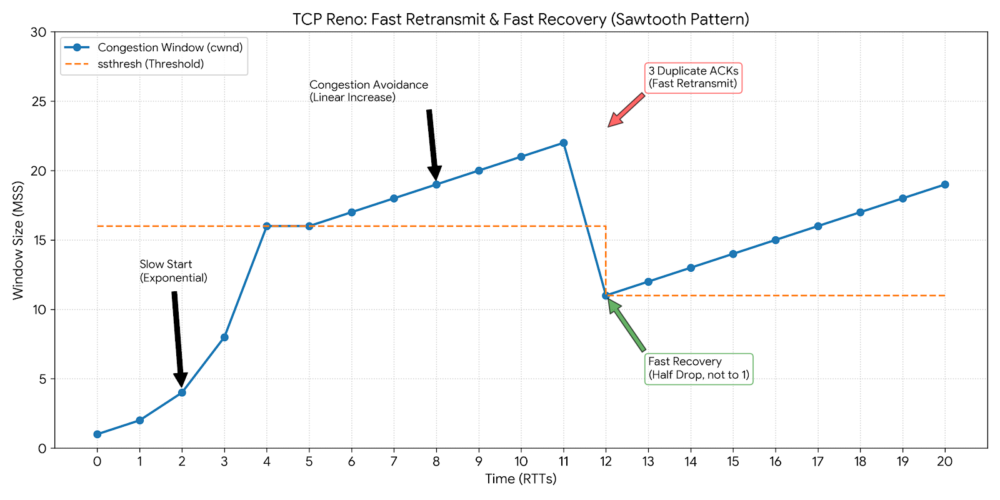

# TCP/IP

## 与OSI7比较

| **OSI 七层模型**           | **TCP/IP 四层模型**   | **每一层跑的主要协议 (Examples)**                            | **功能简述**                                                 |
| -------------------------- | --------------------- | ------------------------------------------------------------ | ------------------------------------------------------------ |
| **应用层 (Application)**   | **应用层** +2         | **HTTP**, **HTTPS**, **FTP**, **DNS**, **SMTP**, **SSH**, **MQTT** | 负责给应用程序提供接口 。你用的 **Drogon** 框架和 **live2mp3** 逻辑就在这。+1 |
| **表示层 (Presentation)**  | **应用层** +1         | **SSL/TLS**, **JSON**, **XML**, **JPEG**, **ASCII**          | 数据格式化、加密、解密、压缩 。                              |
| **会话层 (Session)**       | **应用层** +1         | **RPC**, **NetBIOS**, **NFS**                                | 建立、管理和终止会话 。+3                                    |
| **传输层 (Transport)**     | **传输层** +2         | **TCP** (传输控制协议), **UDP** (用户数据报协议)             | **第一天核心：** 提供端到端的逻辑通信 。TCP 负责可靠流处理 。+2 |
| **网络层 (Network)**       | **网际层 (Internet)** | **IP** (IPv4/IPv6), **ICMP** (Ping命令使用), **IGMP**, **IPsec** | 负责寻址和路由选择（确定数据包怎么走）。                     |
| **数据链路层 (Data Link)** | **网络访问层**        | **Ethernet** (以太网), **Wi-Fi**, **ARP** (地址解析协议), **PPP** | 负责物理寻址（MAC地址）和在物理介质上传输帧 。               |
| **物理层 (Physical)**      | **网络访问层**        | **光纤**, **网线 (RJ45)**, **中继器**, **网卡**              | 传输原始的比特流（0 和 1） 。                                |

## TCP/IP

| **层次 (Layer)**                | **核心功能简述**                                         | **关键协议示例**                    | **编程中的对应关系**                                         |
| ------------------------------- | -------------------------------------------------------- | ----------------------------------- | ------------------------------------------------------------ |
| **应用层 (Application)**        | 直接面向用户，处理特定的应用程序细节 。                  | **HTTP**, **DNS**, **FTP**, **SSH** | 你的 C++ 代码业务逻辑，如 Drogon 框架处理的 JSON 报文 。+1   |
| **传输层 (Transport)**          | **核心目标：** 建立对“流”的敬畏，管理端到端的可靠连接 。 | **TCP**, **UDP**                    | `socket()`, `accept()`, `connect()` 等系统调用直接操作的一层 。 |
| **网际层 (Internet)**           | 负责逻辑寻址和路由选择，解决数据包“怎么走”的问题。       | **IP** (IPv4/IPv6), **ICMP**        | 你在 `bind()` 时指定的 IP 地址，由这一层负责寻址 。          |
| **网络访问层 (Network Access)** | 负责物理介质上的数据传输，处理 MAC 地址和网卡驱动。      | **Ethernet**, **Wi-Fi**, **ARP**    | 底层的网卡驱动与硬件连接，对应用层开发人员基本透明。         |


## 符号位  

| **符号** | **全称**    | **含义与作用**                                               |
| -------- | ----------- | ------------------------------------------------------------ |
| **SYN**  | Synchronize | **同步序号**。用于建立连接。在三次握手的第一步和第二步中出现，表示“我想和你建立连接” 。这是我的起始数字（ISN），请从这里开始计数   只在建立连接的时候出现     这个会**占用一个逻辑序号** |
| **ACK**  | Acknowledge | **确认序号**。表示“我已收到你发来的数据/请求”。除了最初的确认请求外，TCP 报文通常都带有 ACK 位 。 |
| **FIN**  | Finish      | **结束**。用于释放连接。当一方数据发送完毕想断开连接时，会发送 FIN 包进入四次挥手阶段 。  这个会占用一个**逻辑序号** |
| **RST**  | Reset       | **重置**。表示连接出现严重错误，必须强制断开并重新建立。常见于尝试连接一个未开启的端口。 |
| **PSH**  | Push        | **推送**。告诉接收方：立刻将数据交给应用层，不要在缓冲区里攒着。 |
| **URG**  | Urgent      | **紧急**。表示报文中含有紧急数据，需要优先处理。             |

### 注意  这些不是符号位   区分大小写 

| **字段名**                | **常用缩写** | **物理长度** | **核心作用**                                                 | **实战/理论中的含义**                                |
| ------------------------- | ------------ | ------------ | ------------------------------------------------------------ | ---------------------------------------------------- |
| **Sequence Number**       | **seq**      | 32 bits      | **标识发送位**。告诉接收方：这段报文数据是从我这端的哪个字节开始的 。 | “这是我发给你的第 $X$ 号字节。”                      |
| **Acknowledgment Number** | **ack**      | 32 bits      | **确认接收位**。告诉发送方：我已经成功收到了哪些数据，接下来想收哪个字节 。+1 | “我已收到了 $X$ 之前的所有内容，请从 $X+1$ 开始发。” |

## 半连接队列

**SYN Queue** 用于存放那些处于 **SYN_RECV** 状态的连接 。

**触发时机**：当服务端收到客户端发送的 `SYN` 报文（第一次握手）后，内核会将该连接信息放入 SYN Queue 。

**动作**：此时服务端会向客户端回送 `SYN+ACK`，等待客户端的最后一次确认（第三次握手） 。

**状态**：此时连接尚未完全建立，被称为“半连接” 。

发送者无需进入SYN_RECV   

## 客户端与服务端

TCP 连接双方  地位上是平等。但是建立连接时需要一个端先发起请求，另外一个端监听端口。先发起请求的被视为客户端，无需依赖半连接队列和全连接队列，直接通过FD进行管理。而服务端则需要维护这两个队列（由内核完成）


四次挥手的时候，客户端和服务端都有主动发起断联的能力。这里角色双方是平等的      

**在进入全连接队列后，TCP连接即建立完成，在accept之前由内核暂时管理**

**在应用层时，代码每次accept 就是从全连接队列中获取到一个文件描述符。此后该连接就从全连接队列中脱离，交由用户维护**

## 大端序和小端序


## 滑动窗口

**TCP 这个一直都在尝试  试图提高速度，并在拥堵的时候主动减速**


### 简称

| **参数** | **全称**                  | **核心定义**                                              | **典型计算方法 / 公式**                                      | **影响因素**                                 |
| -------- | ------------------------- | --------------------------------------------------------- | ------------------------------------------------------------ | -------------------------------------------- |
| **MTU**  | Maximum Transmission Unit | **数据链路层**能通过的最大数据包大小（含包头）。          | $MTU = \text{IP Header} + \text{TCP Header} + \text{MSS}$    | 物理网络介质（如以太网、光纤、VPN 隧道）。   |
| **MSS**  | Maximum Segment Size      | **传输层** TCP 报文段中应用层数据的最大长度。             | $MSS = MTU - 20(\text{IP}) - 20(\text{TCP})$                 | 握手时双方协商，取二者较小值。               |
| **RTT**  | Round-Trip Time           | **往返时延**。从发送数据到收到对应 ACK 的时间间隔。       | $RTT = \text{收到 ACK 时间} - \text{发送数据时间}$           | 物理距离、路由器排队延迟、丢包重传。         |
| **RTO**  | Retransmission Timeout    | **超时重传时间**。发包后等待 ACK 的最长时间，超时则重发。 | $RTO = SRTT + 4 \times RTTVAR$（基于 RTT 的加权移动平均值计算） | 网络抖动情况。抖动越大，RTO 越保守（越大）。 |

### 拥堵控制-慢启动

- 在拥堵发生（RTO超时）后立即重新慢启动，即从1个MSS 开始启动，


### 快速重传与快速恢复



**快速重传 (Fast Retransmit)**

如果发送方连续收到3个重复的ACK，那么发送方将不等待RTO ，立即触发重传。

**快速恢复**

一般在**快速重传**发生后后采取快恢复的策略。降低到原来的1/2后开始加法增大

### 持续收不到ACK

A. 发送停滞（Window Full）

随着你不断调用 `send()`，你的“未发送但允许发送”部分会被耗尽。最终，你的指针会触碰到窗口的右边界。此时，你的 C++ 程序如果继续发送数据，`send` 函数就会**阻塞**（或者在非阻塞模式下返回 `EAGAIN`）。

B. 触发重传（Retransmission）

TCP 不会永远等下去。

- **超时重传**：如果超过一定时间（RTO）没收到 ACK，发送方会认为数据丢了，直接重发“已发送但未确认”部分的首个数据包。
- **快速重传**：如果你收到了 3 个相同的“冗余 ACK”（比如都要求 Seq 101），说明 101 丢了，发送方不等超时，立刻重传。


## 代码操作

```c++
#include <sys/socket.h>

/**
 * @brief 创建一个通信端点（套接字）
 * * @param domain   协议族（Domain/Family）：
 * - AF_INET: 使用 IPv4 互联网协议 [cite: 5]。
 * - AF_INET6: 使用 IPv6 互联网协议。
 * - AF_UNIX: 用于本地进程间通信 (IPC)。
 * * @param type     套接字类型（Type）：
 * - SOCK_STREAM: 面向连接的字节流，对应 TCP 协议 [cite: 5, 15]。
 * - SOCK_DGRAM: 无连接的数据报，对应 UDP 协议。
 * * @param protocol 特定的协议编号：
 * - 通常设为 0，表示根据 domain 和 type 自动选择默认协议（如 TCP 或 UDP）。
 * * @return 成功：返回一个新的文件描述符 (File Descriptor, fd)，用于后续的 bind/listen/accept [cite: 15]。
 * 失败：返回 -1，并设置全局变量 errno 以指示错误原因。
 */
int socket(int domain, int type, int protocol);


/**
 * @brief 设置与套接字相关的选项控制
 * @param sockfd    套接字文件描述符：由 socket() 返回的 ID。
 * @param level     选项定义的层次：
 * - SOL_SOCKET:  通用套接字层选项（最常用）[cite: 15, 41]。
 * - IPPROTO_TCP: TCP 协议层选项（如禁用 Nagle 算法）[cite: 15, 41]。
 * - IPPROTO_IP:  IP 协议层选项。
 * * @param optname   需设置的选项名称：
 * [SOL_SOCKET 层]
 * - SO_REUSEADDR: 允许重用本地地址和端口（解决第 1 天提到的 TIME_WAIT 导致的无法立即重启问题）[cite: 11]。
 * - SO_REUSEPORT: 允许端口多重绑定（解决第 7 天提到的“惊群效应”，提高多核性能）[cite: 78]。
 * - SO_RCVBUF / SO_SNDBUF: 设置接收/发送内核缓冲区大小。
 * - SO_KEEPALIVE: 开启 TCP 存活检测机制（用于探测对端是否异常掉线）。
 * - SO_RCVTIMEO / SO_SNDTIMEO: 设置收发超时（传入 struct timeval），防止 recv/send 永久阻塞。，不写就永久阻塞
 * - SO_LINGER: 控制 close() 行为（可设置强制关闭，不走四次挥手直接发 RST）[cite: 9]。
 * * [IPPROTO_TCP 层]
 * - TCP_NODELAY: 禁用 Nagle 算法（减少小包延迟，提升实时性）。
 * - TCP_CORK: 攒够一定量的数据再发送（提升带宽利用率，与 NODELAY 相反）。
 * - TCP_KEEPIDLE: 设置 TCP 开始发送心跳包前的空闲时间（配合 KEEPALIVE 使用）。
 * * @param optval    指向存放选项值的缓冲区：通常是一个 int (0 或 1 开启) 或结构体。
 * @param optlen    optval 缓冲区的长度：sizeof(optval)。
 * * @return 成功：返回 0；失败：返回 -1，并设置 errno 指示具体错误。
 */
// 一般在socket 弄出来后立即设置  在bind和建立连接之前
// 这是一个设置单个值的状态的函数，  optval是指这个参数的值，socklen_t这个是类型长度
int setsockopt(int sockfd, int level, int optname, const void *optval, socklen_t这个是类型长度 optlen);


// 这小子和sockaddr是内存对齐的，只是为了方便程序员设置才搞了一个皮，直接通过reinterpret_cast 转就行

/**
 * @brief IPv4 地址结构体 (Internet Socket Address)
 * 用于 bind, connect, accept 等函数中指定 IP 和 端口。
 */
struct sockaddr_in {
    /**
     * @brief 地址族 (Address Family)
     * 在第 1 天的实战中，必须设为 AF_INET，表示使用 IPv4 协议 。
     */
    sa_family_t    sin_family;

    /**
     * @brief 16 位端口号 (Port)
     * 必须使用 htons() 函数将主机字节序转换为网络字节序（大端序） 。
     */
    in_port_t      sin_port;

    /**
     * @brief 32 位 IP 地址结构体
     * 包含一个 s_addr 成员。通常使用 inet_pton() 将字符串（如 "127.0.0.1"）转换填入。
     */
    struct in_addr sin_addr;

    /**
     * @brief 填充字节
     * 仅用于对齐 sockaddr 结构体的大小，通常使用 memset 或 {0} 初始化为全 0。
     */
    unsigned char  sin_zero[8];
};

/**
 * 其中 struct in_addr 的定义如下：
 */
struct in_addr {
    in_addr_t s_addr; // 32位 IPv4 地址 (网络字节序)
};


/**
 * @brief 将套接字与特定的网络地址（IP + Port）绑定
 * * @param sockfd   文件描述符：由 socket() 返回的 ID。
 * @param addr     通用地址结构体指针：通常传入 struct sockaddr_in* 并强转。
 * @param addrlen  地址结构体的长度：sizeof(struct sockaddr_in)。
 * * @return 成功返回 0；失败返回 -1 并设置 errno（常见错误：EADDRINUSE 端口被占用）。
 */
int bind(int sockfd, const struct sockaddr *addr, socklen_t addrlen);


/**
 * @brief 使套接字进入监听状态，等待客户端连接
 * * @param sockfd  文件描述符：必须是已经 bind 成功的 socket。
 * @param backlog 连接队列的最大长度 。
 * - 理解为“全连接队列 (Accept Queue)”的大小 。
 * - 当服务器处理 accept 较慢时，内核能暂存的已完成三次握手的连接数 。
 * * @return 成功返回 0；失败返回 -1。
 */
int listen(int sockfd, int backlog);


/**
 * @brief 从已完成三次握手的队列（Accept Queue）中取出一个连接
 * * @param sockfd    监听套接字：由 socket() 创建、bind() 绑定并 listen() 后的描述符。
 * @param addr      输出参数：指向 sockaddr 结构体的指针，用于保存【客户端】的 IP 和端口。
 * 如果不需要知道客户端信息，可以传入 NULL。
 * @param addrlen   输入输出参数：传入 addr 结构体的大小；函数返回时被设置为客户端地址的实际长度。
 * 如果 addr 为 NULL，则此参数也应为 NULL。
 * * @return 成功：返回一个【全新的文件描述符】，专门用于与该客户端进行通信 (recv/send)。
 * 失败：返回 -1，并设置 errno。
 */
int accept(int sockfd, struct sockaddr *addr, socklen_t *addrlen);


/**
 * @brief 在已连接的套接字上发送数据
 * * @param sockfd   通信文件描述符：对于 Server 是 accept 返回的 fd ；对于 Client 是 socket 返回的 fd 。
 * @param buf      待发送数据的缓冲区指针。
 * @param len      要发送的数据字节数。
 * @param flags    发送标志位：
 * - 0: 默认行为，与 write() 类似。
 * - MSG_NOSIGNAL: 在对端关闭连接时，不触发 SIGPIPE 信号（第 7 天面试强化重点 [cite: 82]）。
 * - MSG_DONTWAIT: 临时开启非阻塞发送（类似于第 2 天的 O_NONBLOCK 效果 [cite: 23]）。
 * * @return 成功：返回实际发送的字节数（可能小于请求发送的 len）。
 * 失败：返回 -1，并设置 errno。
 */
ssize_t send(int sockfd, const void *buf, size_t len, int flags);

/**
 * @brief 从已连接的套接字接收数据
 * * @param sockfd   通信文件描述符：由 accept() 返回（服务端）或 socket() 创建（客户端）的 FD 。
 * @param buf      接收数据的缓冲区指针：数据将从内核缓冲区拷贝到此内存区域。
 * @param len      缓冲区的大小：即你最多打算接收多少字节的数据。
 * @param flags    接收标志位：
 * - 0: 默认行为，阻塞直到有数据到达 。 
 * - MSG_PEEK: 查看数据但不从内核缓冲区中取走（下一次 recv 还能读到同样的内容）。
 * - MSG_WAITALL: 尽量等待直到读满 len 字节才返回（除非连接断开或捕获信号）。
 * - MSG_DONTWAIT: 临时开启非阻塞接收 [cite: 23, 26]。
 * * @return 
 * - > 0: 实际接收到的字节数。
 * - = 0: 表示对端已正常关闭连接（收到 FIN 包），这是判断连接结束的关键 。  这个0绝对不代表收到0字节
 * - -1 : 发生错误，需查看 errno。非阻塞状态下，在拿不到数据的时候是
 */
ssize_t recv(int sockfd, void *buf, size_t len, int flags);


/**
 * 较新的API      
 * @brief 将 IP 地址从字符串（表达格式）转换为二进制（网络格式）
 * * @param af       地址族 (Address Family)：
 * - AF_INET:  针对 IPv4 [cite: 5]。
 * - AF_INET6: 针对 IPv6。
 * @param src      指向以 '\0' 结尾的 IP 字符串指针（如 "127.0.0.1"）。
 * 结合你之前的疑问，这里常传入 std::string::c_str()。
 * @param dst      输出参数：指向存放二进制地址的缓冲区。
 * 对于 IPv4，通常传入 &(sockaddr_in.sin_addr)。
 * * @return 
 * 1: 成功。
 * 0: 输入的 src 格式非法（例如输入了 "999.999.999.999"）。
 * -1: 发生错误（如 af 参数无效），需查看 errno。
 */
int inet_pton(int af, const char *src, void *dst);


/**
 * @brief 将点分十进制的 IPv4 字符串转换为网络字节序的 32 位二进制数值。
 * * @param cp  指向以 '\0' 结尾的 IP 字符串（如 "192.168.1.1"）。
 * * @return 
 * - 成功：返回网络字节序的 32 位无符号整数（in_addr_t）。
 * - 失败：返回 INADDR_NONE（通常是 -1）。
 */
in_addr_t inet_addr(const char *cp);


#include <fcntl.h>

/**
 * fcntl - 操作文件描述符的属性
 * * @param fd    待操作的文件描述符（如 socket() 返回的句柄）
 * @param cmd   操作命令。常用命令包括：
 * F_GETFL: 获取文件状态标志（flags）
 * F_SETFL: 设置文件状态标志（flags）
 * @param ...   变长参数（通常是一个 long 类型的 flags）
 * * @return      成功：返回值取决于 cmd
 * 失败：返回 -1，并设置全局变量 errno 
 */
int fcntl(int fd, int cmd, ... /* arg */ );
```

### fcntl

| **操作分类**     | **命令 (cmd)**    | **参数/标志** | **功能说明**                                                 | **典型应用场景**                                          |
| ---------------- | ----------------- | ------------- | ------------------------------------------------------------ | --------------------------------------------------------- |
| **I/O 行为控制** | `F_GETFL`         | 无            | 获取文件状态标志（如 `O_RDONLY`, `O_NONBLOCK`）。            | 设置非阻塞前的准备工作。                                  |
|                  | `F_SETFL`         | `O_NONBLOCK`  | **设置非阻塞模式**。内核立即返回而不挂起进程。               | **第2天核心任务**：配合 `epoll` 实现高并发。              |
| **生命周期管理** | `F_GETFD`         | 无            | 获取文件描述符标志（目前主要是 `FD_CLOEXEC`）。              | 检查 FD 的描述符级别属性。                                |
|                  | `F_SETFD`         | `FD_CLOEXEC`  | **执行时关闭**。当进程 `exec`（如运行 FFmpeg）时自动关闭该 FD。 | 防止子进程（如视频转码进程）非法继承父进程的监听 Socket。 |
| **描述符复制**   | `F_DUPFD_CLOEXEC` | 下限数值      | 复制 FD，并自动设置 `CLOEXEC` 标志。                         | 在多线程或资源管理类中安全地创建 FD 副本。                |
| **异步通知**     | `F_SETOWN`        | `getpid()`    | 设置接收该 FD 的 I/O 信号（如 `SIGIO`）的进程 ID。           | 信号驱动式 I/O 或处理带外数据（紧急数据）。               |


### recv 和send对连接断开的处理

| **场景分类**        | **对端状态 / 网络状况**                       | **recv 的反应**                   | **send 的反应**                                              | **程序员的应对措施**                                         |
| ------------------- | --------------------------------------------- | --------------------------------- | ------------------------------------------------------------ | ------------------------------------------------------------ |
| **有序关闭 (FIN)**  | 进程调用 `close()`、正常退出或崩溃 (内核代劳) | **返回 0**                        | **第一次写**：返回 > 0 (发往缓冲区) **第二次写**：**触发 SIGPIPE 信号**（默认进程退出） | **必做**：判断 `if(ret==0)` 并关闭 FD。 **必做**：启动时忽略 `SIGPIPE`。 |
| **连接重置 (RST)**  | 对方重启、尝试往已关闭的 Socket 写数据        | **返回 -1** `errno`: `ECONNRESET` | **返回 -1** `errno`: `ECONNRESET`                            | 记录日志，立即 `close(fd)` 清理资源。                        |
| **物理断开 (无包)** | 拔掉网线、交换机故障、对端瞬间掉电            | **永久阻塞** (直到超时)           | **永久阻塞** (直到缓冲区满+重传失败)                         | **进阶方案**：应用层心跳包或设置 `SO_KEEPALIVE`。            |
| **逻辑错误 (本地)** | 本地 FD 已经被 `close()` 过                   | **返回 -1** `errno`: `EBADF`      | **返回 -1** `errno`: `EBADF`                                 | 检查代码逻辑，避免二次关闭或非法操作。                       |

| **函数**   | **返回值** | **错误码 (errno)**       | **场景描述**                                 | **业务层推荐操作**                                  |
| ---------- | ---------- | ------------------------ | -------------------------------------------- | --------------------------------------------------- |
| **`recv`** | **`> 0`**  | 无                       | 成功读取到 $n$ 字节数据。                    | 处理业务逻辑。                                      |
| **`recv`** | **`0`**    | 无                       | **对端正常关闭**（收到 FIN 包）。            | **执行清理**：关闭 `fd`，销毁连接上下文。           |
| **`recv`** | **`-1`**   | `EAGAIN` / `EWOULDBLOCK` | **数据未就绪**。内核接收缓冲区为空 。        | **跳过**：继续事件循环，等待下一次可读提醒。        |
| **`recv`** | **`-1`**   | `ECONNRESET`             | **对端异常强制关闭**（收到 RST 包）。        | **强制清理**：记录日志并立即关闭 `fd`。             |
| **`recv`** | **`-1`**   | `EINTR`                  | 系统调用被信号中断。                         | **重试**：再次调用 `recv`。                         |
| **`send`** | **`> 0`**  | 无                       | 成功发送 $n$ 字节数据。                      | 检查是否发完，若未发完需缓存剩余数据。              |
| **`send`** | **`-1`**   | `EAGAIN` / `EWOULDBLOCK` | **缓冲区已满**。内核发送缓冲区无空间。       | **停止写入**：注册 `EPOLLOUT`，等缓冲区有空位再发。 |
| **`send`** | **`-1`**   | **`EPIPE`**              | **对端已关闭读取**。尝试向已关闭的连接写入。 | **捕获信号**：需忽略 `SIGPIPE` ，否则进程会退出。   |
| **`send`** | **`-1`**   | `ECONNRESET`             | 链路异常，连接被重置。                       | **清理资源**：关闭 `fd`。                           |


# IO 多路复用

[多路复用]:https://cloud.tencent.com/developer/article/2383534

## FD   文件描述符介绍  

[参考网址]: https://cloud.tencent.com/developer/article/2623353


### 简述

每个进程会维护一个自己的files_struct, 用于在下面映射自己打开文件的FD。   FD仅为一个下标，用于在files_struct中快速找到对应的file

| **概念**           | **数量**                  | **作用**                                                |
| ------------------ | ------------------------- | ------------------------------------------------------- |
| **`files_struct`** | 每个进程 **1 个**         | 存放该进程打开的所有文件指针。                          |
| **`fd_array`**     | 1 个数组                  | 下标即 FD，值是 `struct file` 的内存地址。              |
| **`struct file`**  | **每 Open 一次产生 1 个** | **核心！** 记录“这一次打开”的状态（偏移量、读写权限）。 |
| **`struct inode`** | 磁盘上每个文件 **1 个**   | 记录文件的物理信息（大小、权限、在磁盘哪个块）。        |


### 读写方向

| **文件描述符类型** | **方向性** | **缓冲区情况**     | **poll 常用事件**                            |
| ------------------ | ---------- | ------------------ | -------------------------------------------- |
| **TCP Socket**     | **全双工** | 读写缓冲区完全独立 | `POLLIN` & `POLLOUT`                         |
| **UDP Socket**     | **全双工** | 读写独立，但无连接 | `POLLIN` & `POLLOUT`                         |
| **管道 (Pipe)**    | **单工**   | 只有一端缓冲区     | 读端 `POLLIN` / 写端 `POLLOUT`               |
| **普通文件**       | **伪双工** | 共享偏移指针       | 通常不配合 poll 使用（因为文件永远“可读写”） |
| **串口 / 终端**    | **全双工** | 硬件级收发独立     | `POLLIN` & `POLLOUT`                         |


文件在打开的时候   当前进程会创建一个结构体，内部存放如下信息

| **成员变量**    | **类型**           | **作用**                                               |
| --------------- | ------------------ | ------------------------------------------------------ |
| **`f_pos`**     | `loff_t`           | **偏移量**：记录下一次读写的位置。                     |
| **`f_op`**      | `file_operations*` | **方法表**：决定了 read/write 具体怎么执行。           |
| **`f_flags`**   | `unsigned int`     | **状态位**：是否追加写、是否非阻塞。                   |
| **`f_count`**   | `atomic_t`         | **引用计数**：防止文件在使用时被意外关闭。             |
| **`f_mapping`** | `address_space*`   | **页缓存**：处理文件数据在内存中的缓存（Page Cache）。 |

**用户态绝对拿不到fd所对应的file\*  只能通过操作系统提供的接口执行一些操作**

**f_op**：因为linux所有的东西都被视作文件，但是对于不同的文件（连接、文件、管道）等  有着不一样的操作方式，对于用户态来说关心的是read\write 读取写入即可，但是对于内核态来说，他需要知道对于这些特殊文件不同的写入方式，所以记录了read/write的执行方法

**FILE 结构体的本质：封装文件描述符和缓冲区**

 `**FILE**`结构体是 C 标准库（Glibc）提供的，其核心作用是**封装文件描述符和用户级缓冲区**，为用户提供更便捷、高效的 IO 操作。

 `**FILE**`结构体的定义位于`/usr/include/libio.h`（简化版）：

当一个进程被启动的时候，0, 1, 2所对应的FD，代表着stdin  stdout  stderr。这是系统提供的  

| **文件描述符 (FD)** | **名称**              | **宏定义 (C/C++)** | **默认对应设备** | **作用与语义**                                               |
| ------------------- | --------------------- | ------------------ | ---------------- | ------------------------------------------------------------ |
| **0**               | **标准输入 (stdin)**  | `STDIN_FILENO`     | **键盘**         | 进程获取外部数据的主要通道。例如 `scanf` 或 `std::cin` 默认从这里读。 |
| **1**               | **标准输出 (stdout)** | `STDOUT_FILENO`    | **显示器/终端**  | 进程输出正常业务数据的通道。例如 `printf` 或 `std::cout` 默认写到这里。 |
| **2**               | **标准错误 (stderr)** | `STDERR_FILENO`    | **显示器/终端**  | 专门用于输出**错误信息**或**告警**。即使 stdout 被重定向，错误信息通常也能直接显示出来。 |

**这几个玩意类似管道，如果读取不及时，会导致例如printf等同步方法卡顿**

\n   仅换行，等待若干周期后统一刷新    endl   换行并立即刷新


**在任何文件内  都是字节流**    

小端序： 高位丢在低地址   0x12345678    78丢在低地址      现代CPU中一般是小端序

大端序： 反过来。   TCP/IP 规定网络传输时必须是大端序


当你写 Socket 通信代码时，必须记住这组“暗号”：

- **`htonl()`**: **h**ost **to** **n**etwork **l**ong (32位主机序转网络序)
- **`ntohl()`**: **n**etwork **to** **h**ost **l**ong (32位网络序转主机序)


| **场景**         | **系统调用** | **返回值 (FD) 的含义**                                       |
| ---------------- | ------------ | ------------------------------------------------------------ |
| **创建监听服务** | `socket()`   | 返回一个用于“监听”新连接的 FD。                              |
| **接受新客户端** | `accept()`   | 当有客人连接时，内核返回一个新的 FD，专门用于和**这个**客户端通信。 |
| **连接服务器**   | `connect()`  | 客户端调用后，本地会产生一个 FD 用于和服务器通信。           |
| **打开本地文件** | `open()`     | 返回一个用于读写该磁盘文件的 FD。                            |


**默认 FD**：每个进程启动时，内核会自动给你分配 3 个 FD：

- `0`：标准输入（stdin）
- `1`：标准输出（stdout）
- `2`：标准错误（stderr）
- 这也是为什么你自己创建的第一个 socket 通常是从 `3` 开始的原因。

**它是小的非负整数**：内核总是找当前**最小的、还没被占用**的整数分配给你。

**资源限制**：一个进程能拥有的 FD 数量是有限制的（通常是 1024，可以通过 `ulimit -n` 修改）。


在 Linux 中，FD 刚诞生时只是一个“**空白的号码牌**”，它的功能是由你接下来对它执行的**第一个关键动作**决定的。

| **你想让 FD 做什么** | **你需要调用的“身份赋予”函数** | **结果**                                           |
| -------------------- | ------------------------------ | -------------------------------------------------- |
| **做前台接客**       | `bind()` + `listen()`          | 此时这个 FD 变成了 **监听 FD**。                   |
| **做外派业务员**     | `connect()`                    | 此时这个 FD 变成了 **连接 FD**（主动连接服务器）。 |
| **做本地记账**       | `open("file.txt", ...)`        | 此时这个 FD 变成了 **文件 FD**。                   |
| **做内部通讯**       | `pipe()`                       | 此时你会得到一对 FD，变成 **管道 FD**。            |


### 注意一下不同的文件描述符读取写入是不一样的

| **场景**               | **是否用 poll** | **读取逻辑**                                                 |
| ---------------------- | --------------- | ------------------------------------------------------------ |
| **网络 / 管道 / 串口** | **是**          | 依靠 `poll` 叫醒，根据缓冲区大小分批 `read`。                |
| **普通磁盘文件**       | **否**          | 直接 `read`，循环读取直到 EOF；或者用 `mmap` 把文件映射进内存。 |
| **高性能大文件**       | **否**          | 使用 `io_uring` 或 `AIO`，实现真正的异步“一劳永逸”。         |

磁盘文件**永远是可读的，也永远是可写的**。

- **没有“等消息”这一说**：磁盘文件就在那儿躺着。内核认为，只要你调用 `read`，它要么能读出数据，要么读到文件末尾（EOF）返回 0。它不会像 Socket 那样“由于对方没发数据而导致 read 阻塞”。
- **poll 的尴尬**：如果你对一个磁盘文件 fd 调用 `poll`，它会**立即返回**并告诉你 `POLLIN | POLLOUT` 已经就绪。这会让你的 `while` 循环变成一个疯狂吃 CPU 的死循环。

### fwrite与write的区别

- **库函数（`fopen`、`fread`、`fwrite`）**：带有用户级缓冲区，减少系统调用次数，效率更高；
- **系统调用（`open`、`read`、`write`）**：无用户级缓冲区，直接与内核交互，每次调用都会触发用户态到内核态的切换。


## 注意  long在不同系统的表现

| **数据模型** | **操作系统**           | **int** | **long**   | **long long** | **指针 (void\*)** |
| ------------ | ---------------------- | ------- | ---------- | ------------- | ----------------- |
| **ILP32**    | 32位 Windows/Linux     | 32 bit  | **32 bit** | 64 bit        | 32 bit            |
| **LP64**     | **64位 Linux / macOS** | 32 bit  | **64 bit** | 64 bit        | 64 bit            |
| **LLP64**    | **64位 Windows**       | 32 bit  | **32 bit** | 64 bit        | 64 bit            |

## 内核态与用户态

linux一般只使用CPU 提供的用户态和内核态  不使用RING1/2


| **特性**         | **用户态 (User Mode)**                         | **内核态 (Kernel Mode)**                                     |
| ---------------- | ---------------------------------------------- | ------------------------------------------------------------ |
| **CPU 特权等级** | **Ring 3** (最低权限)                          | **Ring 0** (最高权限)                                        |
| **执行主体**     | 你的 C++ 程序、Shell、数据库等                 | 内核进程、硬件驱动程序                                       |
| **指令权限**     | 只能执行非特权指令（加减乘除、跳转等）         | 可执行**特权指令**（如 `HLT` 停机、控制中断、操作底层寄存器） |
| **内存访问**     | 只能访问受限的**用户空间地址**                 | 可以访问**所有物理内存**（包括内核空间和用户空间）           |
| **硬件操作**     | **禁止**直接操作硬件，必须通过系统调用请求内核 | **允许**直接读写磁盘、网卡、显卡（如 4060）等硬件寄存器      |
| **崩溃影响**     | 仅当前进程崩溃（段错误），系统依然稳定         | 可能导致 **Kernel Panic**（系统死机或重启）                  |
| **切换方式**     | 通过 `SYSCALL`、软中断或硬件中断“陷入”内核     | 通过 `SYSRET` 或 `IRET` 指令返回用户态                       |
| **典型开销**     | 无额外切换开销                                 | 涉及寄存器压栈、TLB 刷新、流水线清空，开销较大               |

## select

```c
#define __FD_SETSIZE 1024 // 限制了最大的监听数量

typedef struct {
unsigned long fds_bits[__FD_SETSIZE / (8 * sizeof(long))]; // 通过标准的long数组存储，每一位代表一个监听状态
} __kernel_fd_set;

struct timeval {
time_t      tv_sec;         /* seconds */
suseconds_t tv_usec;        /* microseconds */
};

/**
* 计算公式
要监听的对象FD(N) 所在数组位置  N / sizeof(long)  对应所在long的位   N % sizeof(long)
**/


/**
 * @brief 监视多个文件描述符的状态变化
 * * @param nfds      [In] 监视范围，需设为所有集合中最大 FD 值 + 1。
 * * @param readfds   [In/Out] 可读事件集合。
 * - 入参(In): 你希望监视哪些 FD 是否“可读”。
 * - 出参(Out): 内核会抹除掉未就绪的 FD，仅保留“真正可读”的 FD。
 * - 注意: 每次调用前必须重新设置（或传入备份），否则未就绪的 FD 会丢失。
 * * @param writefds  [In/Out] 可写事件集合。
 * - 入参(In): 你希望监视哪些 FD 是否“可写”。
 * - 出参(Out): 内核会抹除掉不可写的 FD，仅保留“当前可写”的 FD。
 * - 注意: 同样具有“破坏性”，不可循环直接复用。
 * * @param exceptfds [In/Out] 异常事件集合（处理方式同上）。
 * * @param timeout   [In/Out] 超时设置。
 * - 注意: 在 Linux 下，此结构体会被内核修改为“剩余的时间”。
 * - 如果你想在循环中每次都等待固定的 5 秒，必须在每次 select 前重新赋值。
 * * @return int      就绪的 FD 总数 / 0(超时) / -1(错误)。
 */
int select(int nfds, fd_set *readfds, fd_set *writefds, fd_set *exceptfds, struct timeval *timeout);


/**
 * =================================================================================
 * Select 多路复用核心 API 及配套宏 (C++ Linux 环境)
 * =================================================================================
 */

#include <sys/select.h>
#include <sys/time.h>
#include <unistd.h>

/**
 * @brief select 系统调用：监听多个文件描述符上的 I/O 事件。
 * * @param nfds      监听集合中所有文件描述符的最大值 + 1（即 max_fd + 1）。 
 * @param readfds   可读事件集合。内核在此集合中标记哪些 FD 有数据可读或对端关闭。 [cite: 36, 40]
 * @param writefds  可写事件集合。内核在此集合中标记哪些 FD 的发送缓冲区有空间。 [cite: 58]
 * @param exceptfds 异常事件集合。
 * @param timeout   超时时间。
 * - NULL: 永久阻塞直到有事件发生；
 * - {0, 0}: 立即返回（非阻塞轮询）；
 * - {n, m}: 最多等待 n 秒 m 微秒。
 * * @return int 成功返回就绪 FD 的总数；超时返回 0；失败返回 -1 并设置 errno。
 * @note 内核会原地修改传入的 fd_set（只保留就绪位），因此每轮循环必须重新初始化。 
 */
int select(int nfds, fd_set *readfds, fd_set *writefds, fd_set *exceptfds, struct timeval *timeout);


/**
 * @brief FD_ZERO 宏：清空 fd_set 集合。
 * * @param set 指向 fd_set 变量的指针。
 * @details 将位图中所有的位（bit）全部置为 0，通常在每一轮 select 调用前执行。 
 */
void FD_ZERO(fd_set *set);


/**
 * @brief FD_SET 宏：将一个文件描述符添加到 fd_set 集合中。
 * * @param fd  需要监听的文件描述符（Socket 句柄）。
 * @param set 指向目标 fd_set 集合的指针。
 * @details 将位图中第 fd 个位置置为 1。 
 * @warning fd 不得超过 FD_SETSIZE (通常为 1024)，否则会导致内存越界。 
 */
void FD_SET(int fd, fd_set *set);


/**
 * @brief FD_ISSET 宏：检查特定的文件描述符是否已就绪。
 * * @param fd  需要检查的文件描述符。
 * @param set select 函数返回后的就绪位图集合。
 * @return int 若该 FD 已就绪（位为 1）返回非零值；否则返回 0。
 * @details 开发者通常在 select 返回后通过循环遍历此宏来确认具体哪个连接有数据。 
 */
int FD_ISSET(int fd, fd_set *set);


/**
 * @brief FD_CLR 宏：从 fd_set 集合中移除一个文件描述符。
 * * @param fd  需要移除的文件描述符。
 * @param set 指向目标 fd_set 集合的指针。
 * @details 将位图中第 fd 个位置置为 0。常用于客户端断开连接后的清理工作。 [cite: 57]
 */
void FD_CLR(int fd, fd_set *set);
```

### 为什么仍然需要给recv/send设置为非阻塞

| **场景分类**       | **现象描述**                                                 | **阻塞 recv 的后果**                                       | **非阻塞 recv 的优势**                                       |
| ------------------ | ------------------------------------------------------------ | ---------------------------------------------------------- | ------------------------------------------------------------ |
| **虚假唤醒**       | 内核通知 FD 可读，但当你调用 `recv` 时，数据由于校验和错误被丢弃。 | 进程会卡在 `recv` 处，等待下一波数据，导致整个服务器停滞。 | `recv` 立即返回 `-1` 并设置 `errno` 为 `EAGAIN`，服务器继续运行。 |
| **多线程竞争**     | 多个线程同时监听同一个 FD，其中一个线程抢先读完了所有数据。  | 后到的线程会因为没有数据而进入睡眠（阻塞），浪费线程资源。 | 没抢到数据的线程会立即返回，可以去处理其他任务。             |
| **数据被取走**     | 数据到达内核缓冲区后，可能被某些底层协议栈或特定操作（如某些 OOB 处理）提前消耗。 | `recv` 会无限期等待，直到新的数据到达。                    | 确保即使数据“消失”了，当前执行流也不会被锁死。               |
| **原子性与一致性** | 即使 `select` 说“有数据”，它并不能保证数据量足够满足你的应用层逻辑。 | 如果你尝试读 $N$ 字节但实际只有 $M$ 字节，阻塞模式会卡住。 | 配合 `while` 循环读完所有可用数据，然后通过 `EAGAIN` 优雅退出读取逻辑。 |

## poll

```c++
struct pollfd {
    int   fd;         /* 委托内核检查的文件描述符 */
    
    /*-----------------------------------------------------------
     * events: 【输入】告诉内核你关心的事件（可以用 | 组合）
     *----------------------------------------------------------*/
    short events;     /* POLLIN      : 有普通数据可读（最常用，包含 TCP 三次握手请求）
        POLLOUT     : 写缓冲区没满，可以写数据（常用于非阻塞 connect 成功后）
        POLLPRI     : 有紧急数据可读（如 TCP 的带外数据，极少用）
        POLLRDHUP   : 【常用】Linux 2.6.17+ 专用，检测对方关闭连接或半关闭
    */

    /*-----------------------------------------------------------
     * revents: 【输出】内核告诉你实际发生了什么（由内核在返回前填充）
     *----------------------------------------------------------*/
    short revents;    /* [包含上面所有 events 定义的位，另外增加以下三个“被动”位]
        
        POLLERR     : 发生错误（比如无效的 Socket 或异步错误）
        POLLHUP     : 对方挂断（Hang up），连接已断开
        POLLNVAL    : 文件描述符非法（比如 fd 指向了一个没打开的文件）
        
        注意：POLLERR, POLLHUP, POLLNVAL 你不需要在 events 里设置，
              内核只要发现这些情况，一定会通过 revents 告诉你。
       这个东西每次会被完整覆写，因此在编码的时候可以重复利用。但是对于linux内核来说，还是把结构体从用户态->内核态->用户态
    */
};

/**
 * poll - 等待文件描述符上的事件
 * * @fds:     【数组首地址】
 * 指向你定义的 pollfd 结构体数组。内核会遍历这个数组来了解你的需求，
 * 并在返回前修改每个元素的 revents 字段。
 * * @nfds:    【数组长度】
 * 告诉你刚才那个数组里有多少个结构体。
 * 类型是 unsigned long（通常是 nfds_t），因为你理论上可以监听成千上万个。
 * * @timeout: 【超时时间】（单位：毫秒 ms）
 * -1 : 永久阻塞。直到至少有一个 fd 发生事件，否则线程一直“睡觉”。
 * 0 : 立即返回。进去看一眼有没有就绪的，没有就返回 0，不阻塞。
 * >0 : 等待指定的毫秒数。比如 5000 表示最多等 5 秒，超时则返回 0。
 * * @return:  【返回值】
 * > 0 : 实际就绪的 fd 个数。你需要去遍历数组找到 revents != 0 的项。
 * 0 : 超时了，没有任何 fd 就绪。如果 fds 为空（或者是 NULL），且 nfds 为 0：返回值是 0。
 表现行为：poll 会像一个纯粹的“睡眠函数”一样工作，阻塞整整 1000 毫秒，然后准时返回 0。
 * -1 : 出错了（比如被系统信号中断），此时 errno 会被设置。
 */
int poll(struct pollfd *fds, nfds_t nfds, int timeout);


```

| **事件类型**         | **宏示例** | **返回逻辑**                           | **为什么这样设计？**                           |
| -------------------- | ---------- | -------------------------------------- | ---------------------------------------------- |
| **你选中的正常事件** | `POLLIN`   | **按需返回**：发生了且你选了，才返回。 | 避免无效通知，让你只处理你想处理的事。         |
| **你没选的正常事件** | `POLLOUT`  | **屏蔽**：发生了但你没选，不返回。     | 比如你没数据要发，就不必被“可写”事件打扰。     |
| **异常事件**         | `POLLERR`  | **全量强制返回**                       | 这种大事不能漏掉，否则你的程序会死循环或崩溃。 |

**不足**

| **维度**     | **表现描述**        | **根本原因**                                      | **影响**                                               |
| ------------ | ------------------- | ------------------------------------------------- | ------------------------------------------------------ |
| **效率瓶颈** | **$O(N)$ 线性遍历** | 醒来后不知道谁就绪，必须手动 `for` 循环全扫一遍。 | 连接数越多，CPU 开销越大，响应越慢。                   |
| **数据拷贝** | **反复“大搬家”**    | 每次调用都要把整个数组从用户态拷贝到内核态。      | 在海量连接下，内存拷贝会榨干 CPU 带宽。                |
| **重复检查** | **内核也得扫**      | 内核在内部也要遍历一遍你传进去的所有描述符。      | 哪怕 1 万个连接里只有 1 个活跃，内核也要空跑 9999 次。 |


## select与poll区别

| **特性**                      | **Select (老牌/经典)**                                     | **Poll (进化/结构化)**                                       | **优劣评述**                                     |
| ----------------------------- | ---------------------------------------------------------- | ------------------------------------------------------------ | ------------------------------------------------ |
| **数据结构**                  | **位图 (fd_set)**：本质是长数组，每个位代表一个 fd。       | **结构体数组 (pollfd)**：每个 fd 有独立的 `fd/events/revents`。 | `poll` 结构更清晰，易于管理。                    |
| **最大连接数**                | **有限制**：通常硬编码为 **1024**。修改需重新编译内核。    | **无限制**：只要内存足够，可以开启成千上万个。               | `poll` 解决了 `select` 的数量天花板。            |
| **参数重置**                  | **必须重置**：内核会直接修改位图，每次循环都要重新初始化。 | **无需重置**：输入(`events`)和输出(`revents`)分离，可循环复用。 | **`poll` 编码体验大幅领先。**                    |
| **拷贝开销**                  | **需要拷贝**：每次调用都要把位图传给内核。                 | **需要拷贝**：每次调用都要把结构体数组传给内核。             | **两者在底层性能上是半斤八两。**                 |
| **状态丰富度**                | **较弱**：仅支持 读、写、异常（紧急数据）。                | **较强**：支持 `POLLRDHUP` 等更细致的状态。                  | `poll` 更能精准捕捉 Socket 的微妙变化。          |
| **执行效率**                  | **$O(N)$**：内核和用户态都要遍历位图。                     | **$O(N)$**：内核和用户态都要遍历数组。                       | 随着连接数增加，两者都会变得非常缓慢。           |
| **精度/平台**（超时时间精度） | **微秒级**，跨平台性极佳（Windows 常用）。                 | **毫秒级**，Unix/Linux 环境常用。                            | `select` 精度更高，但在 Linux 下 `poll` 更主流。 |


## epoll

### 原理

- 这个在内核中维护了一个数据结构
  - **就绪队列**
    - 用于存放所监听的FD已经有动静的红黑树节点，快速进行通知
  - 红黑树
    - 维护用户期望监听的FD集合
    - 查重、去重   重复的FD 将无法添加
    - 快速修改节点希望监听的事件
    - 在删除时快速找到节点进行释放

### 唤醒流程


### ET和LT

| **维度**     | **LT (Level Triggered) 水平触发**                            | **ET (Edge Triggered) 边缘触发**                             |
| ------------ | ------------------------------------------------------------ | ------------------------------------------------------------ |
| **核心逻辑** | **状态驱动**：只要缓冲区有数据，就会不断触发。               | **变化驱动**：只在数据到达（状态改变）的一瞬间触发。         |
| **内核行为** | 只要就绪链表中的 FD 还有未处理数据，`epoll_wait` 就会持续返回该 FD。 | 事件返回一次后，内核立即将其从就绪链表剔除，直到下次新数据到达。 |
| **编程难度** | **简单**：像传统的 `select/poll`，没读完下次还能拿。         | **高**：必须保证一次性处理完，否则会“丢事件”。               |
| **IO 要求**  | 支持阻塞和非阻塞 IO。                                        | **强制要求**使用非阻塞 IO (`O_NONBLOCK`)。                   |
| **读取方式** | 读一次即可。                                                 | 必须使用 `while` 循环读，直到返回 `EAGAIN`。                 |
| **性能表现** | 触发次数多，存在大量重复通知，系统开销略大。                 | 触发次数最少，减少了内核态与用户态的上下文切换，性能最高。   |
| **适用场景** | 业务逻辑简单、对响应延迟不极端敏感的场景。                   | 高并发、超大规模连接、极致追求 IO 吞吐量的底层框架（如 Nginx）。 |

### 写场景特别注意：永远先写一下，写不了再等

**ET在读方面格外注意，他只响应由可写到不可写，或者不可写到可写变化时才EPOLL响应，所以你没写满缓冲区他压根不通知你**

**LT 和ET**

| **对比维度**                 | **动态开关法 (按需注册)通常配合 LT 模式**                    | **静态始终监听法 (常驻注册)必须配合 ET 模式**                |
| ---------------------------- | ------------------------------------------------------------ | ------------------------------------------------------------ |
| **核心思想**                 | “平时不管，写不下了才临时找 `epoll` 帮忙，帮完立刻解雇。”    | “一次签约，终身有效。`epoll` 永远盯着，但只在关键时刻提醒。” |
| **`epoll_ctl` 调用时机**     | **高频**：每次遇到 `EAGAIN` 都要 `MOD` 加上 `OUT`；数据队列清空后都要 `MOD` 去掉 `OUT`。 | **极低**：仅在 Socket 建立连接（或初始化）时 `ADD` 一次 `OUT | ET`，之后再也不动。 |
| **首发数据逻辑**             | 直接调用 `write`，如果没发完，把剩下的存入应用层 Buffer，并开启 `EPOLLOUT` 监听。 | 直接调用 `write`，如果没发完，把剩下的存入应用层 Buffer，直接去 `epoll_wait`（因为已经挂着监听了）。 |
| **收到 `EPOLLOUT` 后的动作** | 把 Buffer 里的数据发出去。如果发完了，**必须立刻取消监听**（否则 CPU 100%）。 | 必须写个 `while` 循环不断 `write`，**直到再次出现 `EAGAIN`** 或数据发完，然后继续等下一次通知。 |
| **避坑指南**                 | 绝对不能忘记在发送完毕后 `disable_write`。                   | 第一次建立连接时会有一个“空炮” `OUT` 事件，直接忽略即可；后续每次发数据**必须主动先写**，不能死等通知。 |
| **优点**                     | 状态机清晰，所见即所得，不容易出现“死锁”或漏发数据。         | 极致压榨性能，大幅减少 `epoll_ctl` 系统调用导致的用户态/内核态切换开销。 |
| **缺点**                     | 系统调用开销较大，在超高并发、频繁收发的小包场景下会成为性能瓶颈。 | 逻辑稍微反直觉，如果没有严格写到 `EAGAIN`，会导致后续数据永远发不出去（断流）。 |
| **适合场景**                 | **1. 绝大多数常规业务服务器** **2. 请求-响应模型**（如 HTTP 服务器） **3. 长连接但发送频率不固定的场景**（如 IM 聊天） **4. 面试手撕代码**（逻辑严密，最受面试官认可） | **1. 持续的大流量推送**（如 `live2mp3` 的音频流实时分发） **2. 高性能反向代理/网关**（如 Nginx、Envoy） **3. 大文件下载服务器** |

### epoll_Create  历史问题

| **函数名**          | **参数类型** | **核心作用**                                                 | **推荐指数**     |
| ------------------- | ------------ | ------------------------------------------------------------ | ---------------- |
| **`epoll_create`**  | `int size`   | 告诉内核大概有多少 FD（现在已忽略）。linux 08之前的有这个，因为之前用的不是红黑树 | ⭐ (仅限老代码)   |
| **`epoll_create1`** | `int flags`  | 设置 `CLOEXEC` 等内核标志位。                                | ⭐⭐⭐⭐⭐ (现代开发) |


### 代码

```c++
#include <sys/epoll.h>


#include <sys/epoll.h>

/**
 * @brief epoll_data_t - 用户自定义数据联合体
 * * 作用：这是内核专门留给用户存放“上下文”的地方。
 * 注意：由于是 union，在同一时刻只能使用其中一个成员。
 */
typedef union epoll_data {
    void    *ptr;       /* 【最常用】存放用户自定义的对象指针（如 Reactor 中的 Connection 对象地址） */
    int      fd;        /* 【基础】直接存放文件描述符数字 */
    uint32_t u32;       /* 存放 32 位无符号整数 */
    uint64_t u64;       /* 存放 64 位无符号整数 */
} epoll_data_t;

/**
 * @brief struct epoll_event - 事件载体结构体
 * * 作用：
 * 1. 在 epoll_ctl 中：作为【配置单】，告诉内核监控哪些事件。
 * 2. 在 epoll_wait 中：作为【回执单】，内核填充发生的事件并返回给用户。
 */
struct epoll_event {
    /**
     * @brief events - 事件位图（32位掩码）
     * 订阅的时候，是用来给用户传递相关事件以及触发方式的
     * 作为返回值/响应的时候，返回的是目前触发的事件，不会返回触发方式
     * 常用标志位说明：
     * - EPOLLIN      : 可读事件（有数据到达、对端正常关闭连接 EOF）。
     * - EPOLLOUT     : 可写事件（内核发送缓冲区有空位，可以写入）。
     * - EPOLLRDHUP   : 对端断开（TCP对端关闭连接或关闭写半部，处理半关闭非常有用）。
     * - EPOLLET      : 边缘触发 (Edge Triggered)，仅在状态变化时通知一次。
     * - EPOLLONESHOT : 单次触发，触发后自动禁用该 FD 监控，需手动 MOD 重新开启。这个用于避免多线程竞争，当一个线程处理FD的时候，如果有新的数据来了，禁止监控。防止新通知来唤醒其他线程
     * - EPOLLPRI     : 紧急数据（Out-of-band data）。
     * - EPOLLERR     : 错误事件（由内核自动触发，无需手动设置）。
     * - EPOLLHUP     : 挂断事件（如管道读端关闭）。
     */
    uint32_t events;    

    /**
     * @brief data - 用户私有数据
     * 作用：内核不关心其内容，仅在 epoll_wait 返回时原样透传。
     * 优势：使用 .ptr 存放对象指针可实现 O(1) 的业务分发。
     */
    epoll_data_t data;  
};


/**
 * 1. 实例创建
 * @param flags: 现代内核通常设为 0。也可以设为 EPOLL_CLOEXEC（在 fork 后的 exec 阶段自动关闭 FD）。
 * @return: 成功返回 epoll 专用的文件描述符 (epfd)，失败返回 -1。
 * 备注: 对应内核创建 eventpoll 结构体，初始化红黑树 (rbr) 和就绪链表 (rdllist)。
 */
int epoll_create1(int flags);


/**
 * 2. 节点管理 (操作红黑树)
 * @param epfd:  epoll_create1 返回的句柄。
 * @param op:    操作类型：
 * - EPOLL_CTL_ADD: 插入新 FD 到红黑树，并注册回调。
 * - EPOLL_CTL_MOD: 修改已存在的 FD 监控事件（无需重新 ADD）。
 * - EPOLL_CTL_DEL: 从红黑树移除 FD，内核自动注销回调。
 * @param fd:    目标 Socket 或文件描述符。
 * @param event: 核心配置结构体（见下方结构体说明）。这个作为入参，不会被修改
 * @return:      成功返回 0，失败返回 -1。
 */
int epoll_ctl(int epfd, int op, int fd, struct epoll_event *event);


/**
 * 3. 阻塞等待 (检查并收集就绪事件)
 * * @param epfd:      epoll 专用的文件描述符（由 epoll_create/create1 创建）。
 * * @param events:    【输出参数】用户态分配的 epoll_event 结构体数组。
 * - 内核会将就绪的 epitem 从“就绪链表”顺序拷贝到该数组。
 * - 覆盖逻辑：内核从索引 0 开始写入，不保证清理旧数据。
 * - 性能建议：无需在调用前 memset，只需根据返回值遍历即可。
 * * @param maxevents: 告诉内核本次调用最多能接收多少个事件。
 * - 必须大于 0。通常设置为数组的长度。
 * - 即使就绪事件超过此值，内核也只会拷贝 maxevents 个，剩余的留在链表下次取。
 * * @param timeout:   等待时长（毫秒 ms）：
 * - -1: 永久阻塞，直到至少有一个 FD 就绪或捕获到信号。
 * -  0: 立即返回。如果有就绪事件则取走，没有则返回 0。
 * - >0: 指定时间内无事件则返回 0。受系统时钟精度影响，可能略有偏差。
 * * @return:          
 * - > 0: 成功。返回此次拷贝到 events 数组中的就绪事件个数。
 * -   0: 超时。在指定时间内没有任何监控的 FD 发生就绪事件。
 * - -1: 失败。需检查 errno：
 * - EINTR:  被系统信号中断（如 Ctrl+C），通常建议 continue 重试。
 * - EBADF:  epfd 不是有效的描述符（可能已被关闭）。
 * - EFAULT: events 指向的内存空间不可写（地址非法）。
 * - EINVAL: epfd 不是 epoll 句柄或 maxevents <= 0。
 */
int epoll_wait(int epfd, struct epoll_event *events, int maxevents, int timeout);
```


## io_uring


# C++  新特性

## 协程   

```c++
#include <coroutine>
#include <cstddef>

template <typename T>
class Task {
public:
    // =========================================================
    // 1. 协程承诺对象 (Promise) - 编译器与协程状态机交互的接口
    // =========================================================
    struct promise_type {
        // --- 必要接口 (必须提供，否则编译报错) ---
        Task get_return_object();                      // 协程创建时调用，绑定外层 Task
        auto initial_suspend() noexcept;               // 启动策略：挂起(lazy)或立即执行(eager)
        auto final_suspend() noexcept;                 // 结束策略：通常返回自定义 Awaiter 实现对称传递
        void unhandled_exception() noexcept;           // 异常捕获机制
        void return_value(T value);                    // 处理 co_return <value>; (如果是 Task<void> 则写 void return_void();)

        // --- 常用可选接口 (根据高级需求添加) ---
        // template<typename U> 
        // auto yield_value(U&& value);                // 支持 co_yield，常用于 Generator(生成器)
        
        // template<typename U> 
        // auto await_transform(U&& expr);             // 拦截并转换 co_await 表达式 (例如：限制只能 await 特定类型的对象)
        
        // void* operator new(std::size_t size);       // 自定义协程帧的内存分配 (优化堆分配)
        // void operator delete(void* ptr, std::size_t size); 
    };

    // =========================================================
    // 2. Task 生命周期管理 - 遵循 RAII 规范
    // =========================================================
    // --- 必要接口 ---
    ~Task();                                           // 必须负责调用 handle.destroy() 释放协程帧
    Task(Task&& other) noexcept;                       // 必须支持移动语义
    Task& operator=(Task&& other) noexcept;

    Task(const Task&) = delete;                        // 绝对禁止拷贝，防止 double free
    Task& operator=(const Task&) = delete;

    // =========================================================
    // 3. Awaiter (等待器) - 决定 Task 被 co_await 时的行为
    // =========================================================
    struct Awaiter {
        // --- 必要接口 ---
        bool await_ready() const noexcept;             // 检查是否已完成，true 则直接跳过挂起
        
        // 挂起时的逻辑。返回类型可以是：
        // 1. void (挂起并交出控制权)
        // 2. bool (true 挂起, false 恢复自己)
        // 3. std::coroutine_handle<> (对称传递：挂起自己，直接跳转恢复另一个协程)
        auto await_suspend(std::coroutine_handle<> awaiting_coro) noexcept; 
        
        T await_resume();                              // 恢复执行后的最后一步，返回结果或抛出暂存的异常
    };

    // --- 必要接口 ---
    Awaiter operator co_await() const noexcept;        // 使 Task 对象本身变得“可等待”

private:
    // --- 内部状态 ---
    explicit Task(std::coroutine_handle<promise_type> h); // 仅限 promise_type 调用的构造
    
    std::coroutine_handle<promise_type> coro_;         // 核心句柄
};
```

```c++
#include <coroutine>
#include <exception>
#include <utility>
#include <optional>

template <typename T>
class Task {
public:
    // =========================================================
    // 1. 协程承诺对象 (Promise)
    // =========================================================
    struct promise_type {
        // --- 内部状态数据 ---
        std::optional<T> result_;                  // 暂存 co_return 的结果
        std::exception_ptr exception_;             // 暂存未捕获的异常
        std::coroutine_handle<> continuation_;     // 记录等待当前 Task 的父协程

        // --- 接口实现 ---
        Task get_return_object() {
            return Task{std::coroutine_handle<promise_type>::from_promise(*this)}; // 把自己的协程信息拿到  存到coro_
        }

        std::suspend_always initial_suspend() noexcept { 
            return {}; // 惰性启动：创建时不执行，直到被 co_await
        }

        // 自定义 final_suspend 的 Awaiter，实现对称传递
        struct FinalAwaiter {
            bool await_ready() const noexcept { return false; } // 必须挂起
            
            std::coroutine_handle<> await_suspend(std::coroutine_handle<promise_type> h) noexcept {
              	// 
                // 如果有父协程在等，直接返回父协程的句柄（底层 JMP 跳转）
                if (auto continuation = h.promise().continuation_) {
                    return continuation; 
                }
                // 如果是顶层协程，返回 noop 结束调度
                return std::noop_coroutine();
            }
            
            void await_resume() const noexcept {}
        };

        FinalAwaiter final_suspend() noexcept { 
            return {}; 
        }

        void unhandled_exception() noexcept {
            exception_ = std::current_exception(); // 捕获异常
        }

        template <typename U>
        void return_value(U&& value) {
            result_ = std::forward<U>(value);      // 保存结果
        }
    };

    // =========================================================
    // 2. Task 生命周期管理 (RAII)
    // =========================================================
    ~Task() {
        if (coro_) {
            coro_.destroy(); // 释放协程帧的堆内存
        }
    }

    Task(Task&& other) noexcept : coro_(std::exchange(other.coro_, nullptr)) {}
    
    Task& operator=(Task&& other) noexcept {
        if (this != &other) {
            if (coro_) {
                coro_.destroy();
            }
            coro_ = std::exchange(other.coro_, nullptr);
        }
        return *this;
    }

    Task(const Task&) = delete;
    Task& operator=(const Task&) = delete;

    // =========================================================
    // 3. Awaiter (等待器)
    // =========================================================
    struct Awaiter {
        std::coroutine_handle<promise_type> coro_;

        bool await_ready() const noexcept {
            return !coro_ || coro_.done(); // 如果已经跑完了，就不用挂起了
        }
        
        std::coroutine_handle<> await_suspend(std::coroutine_handle<> awaiting_coro) noexcept {
            // 记下父协程的联系方式
            coro_.promise().continuation_ = awaiting_coro;
            // 对称传递：直接跳去执行子协程本身
            return coro_; 
        }
        
        T await_resume() {
            // 如果子协程抛了异常，在这里扔给父协程
            if (coro_.promise().exception_) {
                std::rethrow_exception(coro_.promise().exception_);
            }
            // 返回结果给父协程 (co_await my_task 拿到的值)
            return std::move(*coro_.promise().result_);
        }
    };

    Awaiter operator co_await() const noexcept {
        return Awaiter{coro_};
    }

private:
    // 仅限 promise_type 调用的构造
    explicit Task(std::coroutine_handle<promise_type> h) : coro_(h) {}
    
    std::coroutine_handle<promise_type> coro_;
};
```


## 智能指针

### shared_ptr

| **函数名称**                | **作用说明**                                             | **面试考点 / 注意事项**                                      |
| --------------------------- | -------------------------------------------------------- | ------------------------------------------------------------ |
| **`std::make_shared<T>()`** | **推荐的创建方式**。在堆上分配对象并返回 `shared_ptr` 。 | **异常安全**且性能更高，因为它将对象和控制块（引用计数）申请在同一块内存上 。 |
| **`get()`**                 | 返回指向托管对象的**裸指针**。                           | 永远不要手动 `delete` 这个返回的指针，否则会导致二次释放 。  |
| **`use_count()`**           | 返回当前持有该对象的 `shared_ptr` 数量 。                | 主要用于调试。在多线程环境下，该值仅供参考，因为计数可能随时变化 。 |
| **`reset()`**               | 释放当前对象的所有权 。                                  | 如果计数降为 0，则销毁对象。也可以传入新指针来重定向 。      |
| **`unique()`**              | 检查 `use_count()` 是否为 1。                            | C++17 后建议用 `use_count() == 1` 替代。用于判断自己是否是唯一的拥有者。 |
| **`operator\*` / `->`**     | 解引用操作，像使用普通指针一样访问对象。                 | 在调用前应确保指针不为空，否则会触发段错误。                 |
| **`swap()`**                | 交换两个 `shared_ptr` 所指向的对象。                     | 极其高效的操作，仅交换内部指针，不涉及对象的拷贝或移动。     |

| **操作行为**                           | **线程安全属性** | **涉及的底层组件**                                   |
| -------------------------------------- | ---------------- | ---------------------------------------------------- |
| **引用计数增减**                       | **安全**         | **控制块**：使用原子操作更新 。                      |
| **多个线程读写同一个指针对象**         | **不安全**       | **指针对象本身**：涉及双指针修改，非原子 。          |
| **多个线程通过不同的指针访问同一对象** | **取决于对象**   | **数据对象**：智能指针不保护对象内部数据的并发读写。 |

### unique_ptr

| **函数名称**                | **作用说明**                                                 | **面试考点 / 注意事项**                                      |
| --------------------------- | ------------------------------------------------------------ | ------------------------------------------------------------ |
| **`std::make_unique<T>()`** | **C++14 补全特性**。在堆上创建对象并返回 `unique_ptr` 。     | **最佳实践**：应永远使用它代替 `new`，以确保异常安全并提升性能 。 |
| **`std::move()`**           | **转移所有权**。将左值强制转换为右值引用以触发移动语义 。    | **必考点**：`unique_ptr` 禁用了拷贝，若需转移所有权给另一个指针，必须使用此函数 。 |
| **`release()`**             | 切断关联。返回指向对象的裸指针，并将原智能指针置为空。       | **风险点**：调用后智能指针不再负责释放内存，必须由开发者手动 `delete` 裸指针。 |
| **`reset()`**               | 释放并重置。释放当前指向的对象内存，并可选地指向一个新对象。 | 如果不传参数，则仅仅是释放内存并将指针置为 `nullptr` 。      |
| **`get()`**                 | 返回内部裸指针，但不改变所有权。                             | 通常用于将指针传递给只读不存的 C 风格 API 或函数 。          |
| **`operator\*` / `->`**     | 解引用操作。像使用普通指针一样访问成员或对象。               | `unique_ptr` 大小与裸指针相同，此类操作具有**零性能开销** 。 |

### weak_ptr

- 平时只观察shared_ptr，不增加引用计数，但是增加弱引用计数
- 如果引用计数为0，弱引用计数不为0。**那么shared指向的数据会被释放，控制块保留**，以便于weak_ptr观察
- 如果需要查看使用业务数据，**需lock临时提升为shared_ptr**,不可以直接解引用。

**常见函数**

| **函数名称**      | **作用说明**                                           | **面试考点 / 注意事项**                                      |
| ----------------- | ------------------------------------------------------ | ------------------------------------------------------------ |
| **`lock()`**      | **核心方法**。尝试将 `weak_ptr` 提升为 `shared_ptr` 。 | 如果原对象已销毁，返回空的 `shared_ptr`；否则返回一个有效的指针 。 |
| **`expired()`**   | 快速检查所观察的对象是否已析构。                       | 等同于检查 `use_count() == 0`。通常在调用 `lock()` 前做预判。 |
| **`use_count()`** | 返回观察对象的引用计数。                               | 仅供参考，不建议用于逻辑控制，因为计数可能在下一秒改变。     |
| **`reset()`**     | 清空当前的 `weak_ptr`，不再观察任何对象。              | 不会影响原对象的生命周期。                                   |

## 新语法

### auto

这个在自动推导的时候会去掉原有变量const和引用属性，如果需要的话保留const auto &

### constexpr

这个就是编译能算出来的东西，指定这个让编译器在编译的时候就算一下  提升行呢个

| **特性**         | **const (常量)**                                             | **constexpr (常量表达式)**                                   |
| ---------------- | ------------------------------------------------------------ | ------------------------------------------------------------ |
| **核心语意**     | **运行期只读**。表示变量在初始化后不可修改 。                | **编译期常量**。指示编译器在编译阶段尝试求值以提升性能 。    |
| **求值时间**     | 主要是**运行期**。虽然某些简单情况编译器会优化，但标准不强制 。 | **必须是编译期**（用于变量时）。如果无法在编译期算出，编译器会报错。 |
| **初始化要求**   | 可以用运行时的值初始化（如 `cin` 的输入、函数返回值）。      | 必须用**编译期已知**的值或另一个 `constexpr` 函数初始化。    |
| **严格程度**     | 较宽松。仅保证“不准改” 。                                    | **更严格**。不仅不准改，还必须在程序运行前就定死 。          |
| **修饰函数**     | 修饰成员函数时，表示该函数不会修改对象的成员变量。           | 修饰函数时，表示该函数**具备**在编译期执行的能力。           |
| **作为数组长度** | 不一定可行（取决于编译器实现和初始化方式）。                 | **完全可行**。因为它是确定的编译期值。                       |
| **相互关系**     | 一个 `const` 变量不一定是 `constexpr`。                      | **所有的 `constexpr` 变量都隐式地是 `const` 的。**           |


## 右值引用与语义移动

### 引用对象

引用对象指的就是一个对象的别名，**有点类似指针常量**，**一经初始化后就不能改变引用的目标**，只能改值

### 左值与左值引用

- **左值：** 能表示一个具体对象位置（内存位置）的表达式。 
  - a  arr[1]  *p obj.x   只要能表达一个内存位置的表达是都是 
- **右值**：临时值，一般是计算结果。10 20 这种。  但是特别注意一点，**"asdsad"这种字符串丢在只读区，是静态区的，不算临时的右值**

### std::move

```c++
template<class T>
constexpr std::remove_reference_t<T>&& move(T&& t) noexcept
{
    return static_cast<std::remove_reference_t<T>&&>(t);  // 这里是编译器就确定的，先把类型去掉引用，再转右值引用
}
```


### 右值引用的本质

右值引用不是技术问题，而是 **语义问题**：**即调用者告诉函数内部，外部传入的这个值可以进行偷取**

### 完美传入

```c++
void func(T&& X);   //  这里不能直接是T， 因为这样会引发退化，编译器会直接做拷贝
```


### move与copy

对于 **trivially copyable types**（平凡可复制类型）：

```
copy
move
行为一样
```

包括：

```
int
double
char*
struct POD
```

### 完美转发

完美转发只在“模板函数把参数再传给另一个函数”时才有意义。因为参数进入后，原来是否是左值引用，参数名一定是左值。  转给下一个函数的时候就始终触发左值引用了   

**std::forward\<T\>(arg)不配合模板使用没啥意义**


```c++
template<class T>
void wrapper(T&& arg)
{
    foo(std::forward<T>(arg));
}

// 注意函数模板，会根据类型先生成两个签名，然后根据传入的类型，匹配合适的重载后生成定义。
// 1. 转发左值 (Lvalues)
template <typename _Tp>
constexpr _Tp&& forward(typename std::remove_reference<_Tp>::type& __t) noexcept {
  return static_cast<_Tp&&>(__t);
}

// 2. 转发右值 (Rvalues)
template <typename _Tp>
constexpr _Tp&& forward(typename std::remove_reference<_Tp>::type&& __t) noexcept {
  static_assert(!std::is_lvalue_reference<_Tp>::value,
                "can not forward an rvalue as an lvalue");
  return static_cast<_Tp&&>(__t);
}
```


## 多线程

### thread

```c++
#include <iostream>
#include <thread>   // 包含 thread 类
#include <chrono>   // 包含时间相关函数 (std::chrono)
#include <vector>

void worker(int n) {
    // 模拟耗时操作
    std::this_thread::sleep_for(std::chrono::milliseconds(100));
}

int main() {
    // --- 1. 创建与启动 ---
    // 构造即启动：底层会调用系统 API (如 pthread_create) 立即开启新执行流
    // 如果函数参数左值引用，应当使用ref(id)， 如果是右值引用，传入std::move
    std::thread t1(worker, 42);

    // --- 2. 状态检查 ---
    // joinable(): 返回 bool。检查对象是否关联一个真实线程。
    // 初始状态为 true；一旦调用过 join() 或 detach() 后变为 false。
    if (t1.joinable()) {
        std::cout << "t1 is active and manageable.\n";
    }

    // --- 3. 阻塞等待 ---
    // join(): 挂起当前线程，直到 t1 完成。
    // 执行后，t1 的资源被回收，t1.joinable() 变为 false。
    // 注意：对一个 joinable() 为 false 的对象调用 join() 会抛异常。
    if (t1.joinable()) t1.join();

    // --- 4. 守护后台 ---
    std::thread t2(worker, 10);
    // detach(): 将线程与对象脱离。线程在后台独立运行（直到进程结束）。
    // 风险：必须确保该线程不访问任何已销毁的局部变量。
    if (t2.joinable()) t2.detach();

    // --- 5. 线程识别 (ID) ---
    // get_id(): 获取特定线程对象的唯一标识。
    std::thread::id id1 = t1.get_id(); 
    
    // this_thread::get_id(): 静态函数，获取当前正在运行这行代码的线程 ID。
    std::cout << "Current thread ID: " << std::this_thread::get_id() << "\n";

    // --- 6. 当前线程控制 (this_thread) ---
    // sleep_for(): 让当前线程进入阻塞/睡眠状态，释放 CPU 占用。
    std::this_thread::sleep_for(std::chrono::seconds(1));

    // yield(): 建议操作系统重新调度。
    // 并不保证立即停下，而是告诉 CPU：“如果别的线程急着跑，可以先跑它们的”。
    std::this_thread::yield();

    // --- 7. 对象管理 (Move/Swap) ---
    std::thread t3(worker, 5);
    // std::move(): 转移所有权。t3 变为空（不可 join），t4 接管该线程。
    std::thread t4 = std::move(t3);

    // swap(): 交换两个线程对象所关联的执行流。
    t4.swap(t1); // 此时 t1 又变回了刚才那条线程的对象

    // --- 8. 硬件支持 ---
    // hardware_concurrency(): 静态函数。
    // 返回当前 CPU 的逻辑核心数。如果无法获取，则返回 0。
    unsigned int cores = std::thread::hardware_concurrency();
    std::cout << "CPU Cores: " << cores << "\n";

    return 0;
}
```

### mutex

```c++
#include <iostream>
#include <thread>
#include <mutex>
#include <vector>

struct Account {
    int balance = 1000;
    std::mutex mtx;
};

// 1. 基本互斥操作演示
void basic_mutex_demo() {
    std::mutex m;
    
    // 【基础上锁】(不推荐手动使用，除非特殊场景)
    m.lock();
    // 临界区...
    m.unlock();

    // 【尝试上锁】(非阻塞)
    if (m.try_lock()) {
        // 拿到了锁
        m.unlock();
    } else {
        // 没拿到，去干点别的，不傻等
    }
}

// 2. 动态顺序处理 (防止死锁的两种高级方案)
void transfer(Account& from, Account& to, int amount) {
    // 场景：如果线程A执行转账(张三, 李四)，线程B执行转账(李四, 张三)
    // 如果手动按参数顺序加锁，极易发生死锁。

    // --- 方案 A: std::scoped_lock (C++17 推荐，最简洁) ---
    // 它能一次性锁定多个互斥锁，且内部算法保证不会死锁
    {
        std::scoped_lock lock(from.mtx, to.mtx); 
        if (from.balance >= amount) {
            from.balance -= amount;
            to.balance += amount;
        }
    } // 离开作用域自动释放所有锁

    /* // --- 方案 B: std::lock + std::lock_guard (C++11/14 方案) ---
    std::lock(from.mtx, to.mtx); // 原子性地锁定两个互斥元，不会死锁
    std::lock_guard<std::mutex> lock1(from.mtx, std::adopt_lock); // adopt_lock 表示“我已经锁过了，你负责领养并自动释放”
    std::lock_guard<std::mutex> lock2(to.mtx, std::adopt_lock);
    
    if (from.balance >= amount) {
        from.balance -= amount;
        to.balance += amount;
    }
    */
}

// 3. 灵活锁管理 (std::unique_lock)
void flexible_lock_demo(std::mutex& mtx_a, std::mutex& mtx_b) {
    // unique_lock 比 lock_guard 消耗稍大，但更灵活
    std::unique_lock<std::mutex> lock(mtx_a, std::defer_lock); // 还没锁，先占个位

    // ... 做一些不需要锁的操作 ...

    lock.lock(); // 手动上锁
    
    // ... 修改数据 ...

    lock.unlock(); // 可以在作用域结束前提前手动解锁
    
    // 甚至可以用于转移所有权
    std::unique_lock<std::mutex> lock2 = std::move(lock);
}

int main() {
    Account alice, bob;
    std::thread t1(transfer, std::ref(alice), std::ref(bob), 100);
    std::thread t2(transfer, std::ref(bob), std::ref(alice), 200);

    t1.join();
    t2.join();
    
    std::cout << "Alice: " << alice.balance << ", Bob: " << bob.balance << std::endl;
    return 0;
}


/**
 * @brief std::lock_guard 构造函数
 * * @param m    [mutex_type&] : 要管理的互斥锁实例。
 * @param tag  [std::adopt_lock_t] : 固定传入 std::adopt_lock。(只有这一种，代表不加锁，只接管管理)
 * * @note 
 * 1. 前置条件：当前调用线程【必须已经拥有】该互斥锁 m 的所有权。
 * 2. 底层行为：构造时不调用 m.lock()，仅在内部记录该锁的状态。
 * 3. 释放时机：当该 lock_guard 对象生命周期结束（析构）时，自动调用 m.unlock()。
 * 4. 主要目的：利用 RAII 机制安全地接管手动加锁（如 std::lock()）后的释放责任。
 */
std::lock_guard<std::mutex> lg(m1, std::adopt_lock);


/**
 * @brief std::lock 全局死锁避免函数
 * * @param ...ms [mutex_types&] : 接受两个或更多个互斥锁对象（变长参数）。
 * * @return void
 * * @details 
 * - [核心逻辑]：使用一种“全有或全无”的算法尝试锁定所有传入的互斥锁。
 * - [死锁避免]：如果无法同时获得所有锁，它会释放已经获得的锁并重新尝试，
 * 从而打破“请求与保持”条件，避免因加锁顺序不一致导致的循环等待。
 * - [状态]：函数返回时，所有传入的互斥锁都已被当前线程成功锁定。
 */
std::lock(m1, m2, m3);
```

**mutex 下几个不常用的锁**

```c++
/**
 * @brief std::recursive_mutex (递归互斥锁)
 * * @note 
 * 1. 允许同一线程多次 lock() 而不产生死锁。
 * 2. 内部维护一个计数器，lock 次数必须等于 unlock 次数才能真正释放。
 * 3. 性能略低于 std::mutex，非必要不使用。
 */
std::recursive_mutex mtx;

/**
 * @brief std::timed_mutex (限时互斥锁)
 * * @param timeout [std::chrono::duration] : 等待的时长。
 * @return bool : 成功拿到锁返回 true，超时返回 false。
 */
std::timed_mutex tmtx;

if (tmtx.try_lock_for(std::chrono::milliseconds(500))) {
    // 在 500ms 内拿到了锁
    tmtx.unlock();
}
```


### shared_mutex

```c++
#include <shared_mutex>
#include <chrono>

/*
========================================================
std::shared_timed_mutex
--------------------------------------------------------
C++版本: C++14
类型: 读写锁 (Reader-Writer Mutex) + 超时机制
特点:
    - 支持多个线程同时读 (shared lock)
    - 写操作需要独占锁 (exclusive lock)
    - 支持带超时的加锁操作
========================================================
*/

std::shared_timed_mutex m;

/* ======== 写锁 (exclusive lock) ======== */

// 阻塞直到获取写锁
void lock();

// 尝试获取写锁，立即返回
bool try_lock();

// 释放写锁
void unlock();

/* ======== 写锁（带超时） ======== */

// 在指定时间内尝试获取写锁
template<class Rep, class Period>
bool try_lock_for(const std::chrono::duration<Rep, Period>& timeout_duration);

// 在指定时间点之前尝试获取写锁
template<class Clock, class Duration>
bool try_lock_until(const std::chrono::time_point<Clock, Duration>& timeout_time);

/* ======== 读锁 (shared lock) ======== */

// 获取共享读锁（多个线程可同时持有）
void lock_shared();

// 尝试获取读锁
bool try_lock_shared();

// 释放读锁
void unlock_shared();

/* ======== 读锁（带超时） ======== */

// 在指定时间内尝试获取读锁
template<class Rep, class Period>
bool try_lock_shared_for(const std::chrono::duration<Rep, Period>& timeout_duration);

// 在指定时间点之前尝试获取读锁
template<class Clock, class Duration>
bool try_lock_shared_until(const std::chrono::time_point<Clock, Duration>& timeout_time);


/*
========================================================
std::shared_mutex
--------------------------------------------------------
C++版本: C++17
类型: 读写锁 (Reader-Writer Mutex)
特点:
    - 多线程共享读
    - 单线程独占写
    - 不支持超时锁
    - 实现更轻量，性能通常更好
========================================================
*/

std::shared_mutex sm;

/* ======== 写锁 (exclusive lock) ======== */

// 阻塞直到获取写锁
void lock();

// 尝试获取写锁
bool try_lock();

// 释放写锁
void unlock();

/* ======== 读锁 (shared lock) ======== */

// 获取共享读锁
void lock_shared();

// 尝试获取共享读锁
bool try_lock_shared();

// 释放共享读锁
void unlock_shared();

/*
========================================================
RAII封装（常配合使用）
--------------------------------------------------------
C++版本:
    unique_lock -> C++11
    shared_lock -> C++14
========================================================
*/

// 独占写锁 RAII
std::unique_lock<std::shared_mutex> write_lock(sm);

// 共享读锁 RAII
std::shared_lock<std::shared_mutex> read_lock(sm);
```

### call_once 与 flag_once

```c++
/*
========================================================
std::once_flag
--------------------------------------------------------
C++版本: C++11
作用:
    用于配合 std::call_once 实现“只执行一次”的初始化机制
特点:
    - 线程安全
    - 多线程环境中保证某段代码只执行一次
    - 常用于单例初始化 / 全局资源初始化
========================================================
*/

std::once_flag init_flag;

/*
========================================================
std::call_once
--------------------------------------------------------
C++版本: C++11
头文件: <mutex>

作用:
    保证指定函数在所有线程中只执行一次

函数模板:
*/
template<class Callable, class... Args>
void call_once(std::once_flag& flag, Callable&& f, Args&&... args);

/*
参数说明:

flag
    once_flag 对象，用于记录是否执行过

f
    需要执行一次的函数

args
    传递给函数 f 的参数
*/

```

### 三个锁管理器使用的标签

```c++
#include <mutex>
#include <shared_mutex>

/*
========================================================
Tag: std::defer_lock
Header: <mutex>
Since : C++11

作用:
    延迟加锁。构造锁管理器时不会调用 lock() / lock_shared()，
    需要之后手动调用 lock()。

适用锁管理器:
    - std::unique_lock
    - std::shared_lock

典型用途:
    配合 std::lock() 同时锁多个 mutex，避免死锁。

示例:
    std::mutex m;
    std::unique_lock<std::mutex> lock(m, std::defer_lock);
    lock.lock();   // 手动加锁
========================================================
*/


/*
========================================================
Tag: std::try_to_lock
Header: <mutex>
Since : C++11

作用:
    构造锁管理器时尝试获取锁，如果失败不会阻塞。

行为:
    内部调用 try_lock() / try_lock_shared()

适用锁管理器:
    - std::unique_lock
    - std::shared_lock

检测是否成功:
    lock.owns_lock()

示例:
    std::mutex m;
    std::unique_lock<std::mutex> lock(m, std::try_to_lock);

    if (lock.owns_lock())
    {
        // 获取锁成功
    }
========================================================
*/


/*
========================================================
Tag: std::adopt_lock
Header: <mutex>
Since : C++11

作用:
    接管已经加锁的 mutex。
    表示 mutex 已经被 lock()，锁管理器只负责析构时 unlock()。

注意:
    使用前必须保证 mutex 已经被锁，否则行为未定义。

适用锁管理器:
    - std::unique_lock
    - std::lock_guard
    - std::shared_lock (针对 shared_mutex)

示例:
    std::mutex m;

    m.lock();  // 手动加锁

    std::unique_lock<std::mutex> lock(m, std::adopt_lock);
    // lock 接管锁的所有权

    // 离开作用域自动 unlock
========================================================
*/
```


### 条件变量

- 这个接口本身不检查条件，只负责“解锁 + 等待 + 被唤醒后重新加锁”。这里传入的unique_lock,wait时：  释放锁-》等待通知->收到通知-》重新获取锁。    主要是干这个
- 这东西有概率虚假唤醒， 所以最好搞个条件变量，调用 void wait(std::unique_lock<std::mutex>& lock, Predicate pred);  这个版本的


```c++
#include <condition_variable>

class std::condition_variable
{
public:

    /*
    唤醒一个正在等待该条件变量的线程

    参数：
        无

    返回值：
        void

    用法：
        cv.notify_one();
    */
    void notify_one() noexcept;


    /*
    唤醒所有正在等待该条件变量的线程

    参数：
        无

    返回值：
        void

    用法：
        cv.notify_all();
    */
    void notify_all() noexcept;


    /*
    使当前线程进入等待状态，直到被唤醒

    参数：
        lock
            类型：std::unique_lock<std::mutex>&
            说明：当前线程持有的互斥锁

    行为：
        1. 释放 lock 关联的 mutex
        2. 线程进入阻塞
        3. 被 notify 唤醒
        4. 重新获取 mutex

    返回值：
        void

    用法：
        cv.wait(lock);
    */
    void wait(std::unique_lock<std::mutex>& lock);


    /*
    当 pred() == false 时持续等待
    当 pred() == true 时返回

    参数：
        lock
            类型：std::unique_lock<std::mutex>&

        pred
            类型：Predicate   一般是无参bool返回值函数  
            说明：返回值可转换为 bool 的可调用对象

    行为：
        等价于

        while(!pred())
            wait(lock);

    返回值：
        void

    用法：
        cv.wait(lock, pred);
    */
    template<class Predicate>
    void wait(std::unique_lock<std::mutex>& lock, Predicate pred);


    /*
    在指定时间内等待，直到被唤醒或超时

    参数：
        lock
            类型：std::unique_lock<std::mutex>&

        rel_time
            类型：std::chrono::duration

    返回值：
        类型：std::cv_status
            std::cv_status::timeout
            std::cv_status::no_timeout

    用法：
        cv.wait_for(lock, duration);
    */
    template<class Rep, class Period>
    std::cv_status wait_for(
        std::unique_lock<std::mutex>& lock,
        const std::chrono::duration<Rep, Period>& rel_time
    );


    /*
    在指定时间内等待，直到 pred() == true 或超时

    参数：
        lock
            类型：std::unique_lock<std::mutex>&

        rel_time
            类型：std::chrono::duration

        pred
            类型：Predicate

    返回值：
        bool
            true  : pred() == true
            false : 超时

    用法：
        cv.wait_for(lock, duration, pred);
    */
    template<class Rep, class Period, class Predicate>
    bool wait_for(
        std::unique_lock<std::mutex>& lock,
        const std::chrono::duration<Rep, Period>& rel_time,
        Predicate pred
    );


    /*
    等待直到某个绝对时间点，直到被唤醒或超时

    参数：
        lock
            类型：std::unique_lock<std::mutex>&

        timeout_time
            类型：std::chrono::time_point

    返回值：
        std::cv_status

    用法：
        cv.wait_until(lock, time_point);
    */
    template<class Clock, class Duration>
    std::cv_status wait_until(
        std::unique_lock<std::mutex>& lock,
        const std::chrono::time_point<Clock, Duration>& timeout_time
    );


    /*
    等待直到 pred() == true 或到达指定时间点

    参数：
        lock
            类型：std::unique_lock<std::mutex>&

        timeout_time
            类型：std::chrono::time_point

        pred
            类型：Predicate

    返回值：
        bool
            true  : pred() == true
            false : 超时

    用法：
        cv.wait_until(lock, time_point, pred);
    */
    template<class Clock, class Duration, class Predicate>
    bool wait_until(
        std::unique_lock<std::mutex>& lock,
        const std::chrono::time_point<Clock, Duration>& timeout_time,
        Predicate pred
    );
};
```


### 线程池的实现   

```c++
#include <iostream>
#include <vector>
#include <thread>
#include <queue>
#include <mutex>
#include <condition_variable>
#include <functional>
#include <stdexcept>

class ThreadPool {
public:
    /**
     * @brief 构造函数：初始化并启动指定数量的工作线程
     * @param numThreads 线程池中线程的数量
     */
    explicit ThreadPool(size_t numThreads) : stop_(false) {
        for (size_t i = 0; i < numThreads; ++i) {
            // 在工作线程向量中直接构造线程 (emplace_back)
            workers_.emplace_back([this] {
                // 每个线程的主循环
                while (true) {
                    std::function<void()> task;

                    {
                        // 使用 unique_lock，因为 condition_variable 等待时需要反复加锁/解锁
                        std::unique_lock<std::mutex> lock(mtx_);

                        // --- 关键点：条件变量等待 ---
                        // 1. 释放 lock 并挂起线程，直到被 notify。
                        // 2. 被唤醒后，检查 Lambda 表达式（谓词）：
                        //    若返回 false（即未停止且队列为空），继续睡眠；
                        //    若返回 true（即收到停止信号或有新任务），重新持有 lock 并向下执行。
                        cv_.wait(lock, [this] {
                            return stop_ || !tasks_.empty();
                        });

                        // 如果线程池停止且任务队列已清空，则线程退出循环（销毁）
                        if (stop_ && tasks_.empty()) {
                            return;
                        }

                        // 从队列首部取出任务 (使用移动语义减少拷贝)
                        task = std::move(tasks_.front());
                        tasks_.pop();
                    } // lock 在此处析构解锁，让其他线程有机会抢占任务

                    // 在临界区之外执行任务，避免阻塞其他线程取任务
                    task();
                }
            });
        }
    }

    /**
     * @brief 析构函数：确保所有线程安全退出
     */
    ~ThreadPool() {
        {
            // 修改停止标志位前加锁
            std::lock_guard<std::mutex> lock(mtx_);
            stop_ = true;
        }

        // 唤醒所有阻塞在 wait 处的线程，让它们检查 stop_ 标志并退出
        cv_.notify_all();

        // 逐个等待工作线程完成当前任务并回收资源。这小子所有的线程实际上都是在循环里等待任务进来，通过cv来等待信号量。只有最后需要join。如果开的时候就join会阻塞线程，而选择detach会导致退出时失去对子线程的等待
        for (auto& worker : workers_) {
            if (worker.joinable()) {
                worker.join();
            }
        }
    }

    /**
     * @brief 向任务队列中添加新任务
     * @param task 一个包装了可执行函数对象的 std::function
     */
    void enqueue(std::function<void()> task) {
        {
            std::lock_guard<std::mutex> lock(mtx_);

            // 如果已经调用了析构函数（stop_ 为 true），禁止添加新任务
            if (stop_) {
                throw std::runtime_error("ThreadPool has stopped");
            }

            // 将任务移动进队列，高效原位构造 (push 内部会调用移动)
            tasks_.push(std::move(task));
        }

        // 唤醒一个正在等待任务的工作线程
        cv_.notify_one();
    }

private:
    std::vector<std::thread> workers_;          // 工作线程容器
    std::queue<std::function<void()>> tasks_;   // 任务队列

    std::mutex mtx_;                            // 用于保护任务队列和停止标志的互斥锁
    std::condition_variable cv_;                // 用于阻塞和唤醒工作线程的条件变量
    bool stop_;                                 // 线程池运行状态标志
};
```

## 

### 等待机制


#### 条件变量等待

指CV

谓词                                                                                                                                                                                                                                                                                                                                                                                                                                                                                                                                                                                                                                                                                                                                                                                                                                                                                                                                                                                                                                                                                                                                                                                                                                                                                                                                                                                                                                                                                                                                                                                                                                                                                                                                                                                                                                                                                                                                                                                                                                                                                                                                                                                                                                                                                                                                                                              

> **谓词（predicate）是一个返回 `bool` 的函数，用来判断“线程是否可以继续执行”。**

指的是cv 那边的wait里的条件


#### 睡眠等待 

```c++
#include <thread>
#include <chrono>

/**
 * ============================================================
 * 1. std::this_thread::sleep_for
 * ============================================================
 * @brief 相对时间休眠：使当前线程暂停执行指定的【时长】。
 * * @param rel_time [const std::chrono::duration&] : 
 * 要休眠的时间长度（如：std::chrono::milliseconds(100)）。
 * * @details 
 * - 行为：线程进入“阻塞（Blocked）”状态，彻底放弃 CPU，直到计时器到期。
 * - 调度：操作系统会将该线程从就绪队列移除，到期后重新放入。
 * - 场景：最常用的休眠方式，用于控制执行频率或减少 CPU 占用。
 */
std::this_thread::sleep_for(std::chrono::seconds(1));


/**
 * ============================================================
 * 2. std::this_thread::sleep_until
 * ============================================================
 * @brief 绝对时间休眠：使当前线程暂停执行，直到达到指定的【时间点】。
 * * @param abs_time [const std::chrono::time_point&] : 
 * 未来的某个确定的时间戳。
 * * @details 
 * - 行为：与 sleep_for 类似，但它基于绝对时刻。
 * - 场景：适用于定时任务。例如，如果你想每隔 100ms 执行一次，
 * sleep_until(next_cycle) 比 sleep_for(100ms) 更精确，
 * 因为它排除了代码逻辑本身执行所消耗的时间。
 */
auto next_cycle = std::chrono::steady_clock::now() + std::chrono::milliseconds(100);
std::this_thread::sleep_until(next_cycle);


/**
 * ============================================================
 * 3. std::this_thread::yield
 * ============================================================
 * @brief 让出执行权：建议操作系统暂停当前线程，重新调度。
 * * @details 
 * - 行为：当前线程不会进入阻塞状态，而是从“运行中”回到“就绪（Ready）”状态。
 * - 调度：它告诉内核：“我现在不急着跑，可以把 CPU 先给其他同优先级的线程”。
 * - 结果：如果没有其他合适线程，当前线程可能会【立即再次执行】。
 * - 场景：用于自旋锁（Spinlock）或忙等（Busy-waiting）循环中，防止某个线程过度独占 CPU。
 */
std::this_thread::yield();
```

### arm 需要格外注意内存栅栏与原子变量内存序，因为这个是弱内存模型，经常重排指令


### 原子变量

#### std::atomic_flag

**这个是唯一保证是原子的简单逻辑类型**

| **接口名称**           | **功能描述**                                                | **内存语义支持**                         |
| ---------------------- | ----------------------------------------------------------- | ---------------------------------------- |
| **`test_and_set`**     | **核心操作**。将 flag 设为 true，并返回设为 true 之前的值。 | 支持所有 `memory_order`                  |
| **`clear`**            | 将 flag 恢复为 false。                                      | 支持除 `acquire` 和 `acq_rel` 以外的语义 |
| **`ATOMIC_FLAG_INIT`** | **宏初始化**。必须用它来初始化 flag 为 false 状态。         | N/A                                      |

```c++
#include <atomic>

// 1. 初始化 (C++11 要求必须使用此宏初始化为 false)
std::atomic_flag lock_flag = ATOMIC_FLAG_INIT;

void example() {
    // 2. test_and_set (设置并获取旧值)
    // 逻辑：旧值 = flag; flag = true; return 旧值;
    // 常用作自旋锁：如果返回 true，说明别人已经占用了，继续循环
    while (lock_flag.test_and_set(std::memory_order_acquire)) {
        // 自旋等待...
    }

    // --- 临界区代码 ---

    // 3. clear (清除/重置)
    // 逻辑：flag = false;
    // 相当于释放锁
    lock_flag.clear(std::memory_order_release);
}
```

**常见操作**

```c++
#include <atomic>

/**
 * @brief 模板类 std::atomic (C++11/14)
 * @details 提供了对其包装的类型 T 进行无锁并发访问的原子操作接口。
 */
template <class T>
struct atomic {
    /**
     * @brief 默认构造或使用初始值构造。
     * @param desired 初始化的值。
     * @note 构造函数本身【不是】原子的。
     */
    constexpr atomic(T desired) noexcept;

    /**
     * @brief 检查该类型的原子操作是否无锁。
     * @return bool 如果完全由硬件级无锁原子指令实现，返回 true；若底层依赖互斥锁，返回 false。
     */
    bool is_lock_free() const volatile noexcept;

    /**
     * @brief 原子地将新值写入。
     * @param desired 要写入的新值。
     * @param order   内存同步顺序，默认为顺序一致性。
     */
    void store(T desired, std::memory_order order = std::memory_order_seq_cst) volatile noexcept;

    /**
     * @brief 原子地读取当前值。
     * @param order 内存同步顺序。
     * @return T 当前原子变量持有的值。
     */
    T load(std::memory_order order = std::memory_order_seq_cst) const volatile noexcept;

    /**
     * @brief 原子地用新值替换当前值，并返回替换前的值。
     * @param desired 想要写入的新值。
     * @param order   内存同步顺序。
     * @return T 发生替换【之前】的旧值。
     */
    T exchange(T desired, std::memory_order order = std::memory_order_seq_cst) volatile noexcept;

    /**
     * @brief 强比较并交换 (Compare-And-Swap)。
     * @details 原子地比较当前值与 expected：
     * - 如果相等，将当前值更新为 desired，返回 true。
     * - 如果不等，将 expected 修改为当前实际值，返回 false。
     * @param expected 期望值引用 (失败时会被修改)。
     * @param desired  目标值。
     * @param order    内存同步顺序。
     * @return bool 交换是否成功。
     */
    bool compare_exchange_strong(T& expected, T desired,
                                 std::memory_order order = std::memory_order_seq_cst) volatile noexcept;

    /**
     * @brief 弱比较并交换。
     * @details 接口与 strong 相同。但允许“伪失败”（即使值相等也可能由于平台原因返回 false）。这个主要是赋值失败 而f
     * @note 仅推荐在 while 循环中使用，性能通常比 strong 更好。
     */
    bool compare_exchange_weak(T& expected, T desired,
                               std::memory_order order = std::memory_order_seq_cst) volatile noexcept;


    // ========================================================================
    // 以下算术与位运算接口仅在 T 为【整型】(Integral) 或【指针】时有效
    // ========================================================================

    /**
     * @brief 原子自增操作。
     * @param arg 要增加的数值。
     * @return T 执行加法【之前】的旧值。
     */
    T fetch_add(T arg, std::memory_order order = std::memory_order_seq_cst) volatile noexcept;

    /**
     * @brief 原子自减操作。
     * @param arg 要减少的数值。
     * @return T 执行减法【之前】的旧值。
     */
    T fetch_sub(T arg, std::memory_order order = std::memory_order_seq_cst) volatile noexcept;

    /**
     * @brief 原子按位与 (AND) 操作。
     * @param arg 掩码值。
     * @return T 执行位运算【之前】的旧值。
     */
    T fetch_and(T arg, std::memory_order order = std::memory_order_seq_cst) volatile noexcept;

    /**
     * @brief 原子按位或 (OR) 操作。
     * @return T 执行位运算【之前】的旧值。
     */
    T fetch_or(T arg, std::memory_order order = std::memory_order_seq_cst) volatile noexcept;

    /**
     * @brief 原子按位异或 (XOR) 操作。
     * @return T 执行位运算【之前】的旧值。
     */
    T fetch_xor(T arg, std::memory_order order = std::memory_order_seq_cst) volatile noexcept;
};
```

**volatile与atomic**

**volatile**只是告诉程序 每次都去内存中读取，不要用寄存器中的值。  **本身实际上跟线程安全没关系**    ，也不能防止指令重排。  这个是为了防止硬件优化的

#### **几个原子序**

这个是保证原子变量所在函数内的执行顺序的，**不影响原子变量内部顺序**。同一原子变量强制所有线程看到的都是同样的写入顺序

| **内存序选项**             | **对应操作类型** | **同步强度** | **核心语义与约束**                                           | **典型应用场景**                                         |
| -------------------------- | ---------------- | ------------ | ------------------------------------------------------------ | -------------------------------------------------------- |
| **`memory_order_relaxed`** | Load / Store     | **最低**     | **松散顺序**：仅保证操作的原子性。不保证跨线程的任何顺序约束，编译器和硬件可随意重排序。 | 计数器增加（如 `shared_ptr` 引用计数），不涉及数据同步。 |
| **`memory_order_consume`** | Load             | **较低**     | **消费语义**：仅对有**数据依赖**的操作禁止重排序。由于实现复杂，目前主流编译器多将其提升为 `acquire`。 | 很少直接使用。理论上用于读取指向数据的指针并访问该数据。 |
| **`memory_order_acquire`** | Load             | **中**       | **获取语义**：后续所有读写操作都不允许重排到此操作之前。确保能看到另一线程 `release` 之前的所有写入。 | 标志位检查（Read-Acquire），用于“接收”同步信号。         |
| **`memory_order_release`** | Store            | **中**       | **释放语义**：此前所有读写操作都不允许重排到此操作之后。确保此前的写入对其他 `acquire` 的线程可见。 | 数据发布（Write-Release），用于“发出”同步信号。          |
| **`memory_order_acq_rel`** | RMW (读改写)     | **高**       | **获取-释放语义**：同时具备 `acquire` 和 `release` 约束。此前此后的操作都不能越过此界限**。对本线程而言 顺序确定  不会被重排** | 无锁队列的入队/出队、原子自增后的后续操作。              |
| **`memory_order_seq_cst`** | 全部             | **最高**     | **顺序一致性**（默认值）：最强约束。所有线程看到的内存操作顺序完全一致。防止所有可能的重排序。这个主要时防止一方写了内容，另外一方CPU上缓存没拿过来 。 要求所有CPU在执行的时候立即向全局发布，确保所有人可以看到这个操作。这样来说全局的顺序就一致 | 对安全性要求极高、且不确定底层重排序影响时的首选。       |


#### 常见用途（待补充）

| #    | 模式                   | 核心用途             | 常用 memory order         |
| ---- | ---------------------- | -------------------- | ------------------------- |
| 1    | Flag / Stop Signal     | 线程停止             | acquire / release         |
| 2    | Publish–Consume        | 数据发布             | acquire / release         |
| 3    | Message Passing        | 线程通信             | release → acquire         |
| 4    | Atomic Counter         | 计数统计             | relaxed                   |
| 5    | Spinlock               | 轻量锁               | acquire / release         |
| 6    | Double Checked Locking | 单例初始化           | acquire / release         |
| 7    | SPSC Queue             | 单生产者单消费者队列 | relaxed + acquire/release |
| 8    | Lock-Free Stack/Queue  | CAS 无锁结构         | CAS + acq_rel             |


### 内存屏障  


```c++
#include <atomic>

// 建立非原子和原子内存访问的同步顺序，不关联具体的原子对象
// 枚举值参考原子变量中的表格     
extern "C" void atomic_thread_fence( std::memory_order order ) noexcept;
```


### 异步编程模型     

#### future && promise

**注意promise , 如果执行过程中直接抛出异常（非set）， 会从线程直接抛出，使得程序崩溃**

**promise**

```c++
#pragma once
#include <future>
#include <exception>

namespace std {
/// 内部会维护一个原子变量，，标记当前是 undetermined（进行中）、ready（已就绪）还是 exception（抛出异常）。
/// @brief std::promise 提供了一个设施，用于存储一个值或一个异常，该值或异常稍后可通过 std::future 对象异步获取。
/// @tparam R 承诺存储的值的类型。可以是 void 或引用类型。
template< class R >
class promise {
public:
    /// @name 构造、析构与赋值操作
    /// @{

    /// @brief 构造一个空的 promise 对象，初始化一个新的共享状态。
    promise();

    /// @brief 移动构造函数。接管 other 的共享状态。
    /// @param other 将被转移所有权的 promise 对象。移动后 other 不再具有共享状态。
    promise( promise&& other ) noexcept;

    /// @brief 禁用拷贝构造函数（promise 是独占的，不可拷贝）。
    promise( const promise& other ) = delete; 

    /// @brief 析构函数。如果共享状态尚未就绪，则存入一个 std::future_error (带有 broken_promise 错误码)，并唤醒所有等待者。
    ~promise();

    /// @brief 移动赋值操作符。释放当前共享状态（若有），并接管 other 的共享状态。
    /// @param other 将被转移所有权的 promise 对象。
    /// @return 引用自身的 promise 对象。
    promise& operator=( promise&& other ) noexcept;

    /// @brief 禁用拷贝赋值操作符。
    promise& operator=( const promise& other ) = delete;
    /// @}

    /// @brief 交换两个 promise 对象的共享状态。
    /// @param other 要与之交换的另一个 promise 对象。
    void swap( promise& other ) noexcept;

    /// @brief 返回一个与当前 promise 对象的共享状态相关联的 std::future 对象。
    /// @return std::future<R> 与该 promise 共享同一个状态的 future 对象。
    /// @throw std::future_error 如果该 promise 已经调用过 get_future()，则抛出 future_already_retrieved。
    std::future<R> get_future();

    /// @name 状态装填 (立即就绪)
    /// @{

    /// @brief 将共享状态的值设置为 value，并将状态标志为 ready（就绪），唤醒所有等待的线程。
    /// @param value 要存入共享状态的常量左值引用。
    /// @throw std::future_error 如果状态已经就绪，抛出 promise_already_satisfied。
    void set_value( const R& value );

    /// @brief 将共享状态的值设置为 value (右值版本，用于移动语义)，并将状态标志为 ready。
    /// @param value 要存入共享状态的右值引用，将被移动到共享状态中。
    /// @throw std::future_error 如果状态已经就绪，抛出 promise_already_satisfied。
    void set_value( R&& value );

    /// @brief 将共享状态设置为异常状态，并将状态标志为 ready，唤醒所有等待的线程。
    /// @param p 指向要存储的异常的 std::exception_ptr。通常由 std::current_exception() 获取。
    /// @throw std::future_error 如果状态已经就绪，抛出 promise_already_satisfied。
    void set_exception( std::exception_ptr p );
    /// @}

    /// @name 状态装填 (延迟就绪)
    /// @{

    /// @brief 将共享状态的值设置为 value，但直到当前线程退出（所有线程局部变量被销毁）后，才将状态标志为 ready 并唤醒等待者。
    /// @param value 要存入共享状态的常量左值引用。
    /// @throw std::future_error 如果状态已经就绪，抛出 promise_already_satisfied。
    void set_value_at_thread_exit( const R& value );

    /// @brief 将共享状态的值设置为 value (右值版本)，直到当前线程退出后才标志为 ready。  防止有共用资源再没退出的时候就被future拿到了   
    /// @param value 要移动到共享状态的右值引用。
    /// @throw std::future_error 如果状态已经就绪，抛出 promise_already_satisfied。
    void set_value_at_thread_exit( R&& value );

    /// @brief 将共享状态设置为异常状态，直到当前线程退出后才标志为 ready。
    /// @param p 指向要存储的异常的 std::exception_ptr。
    /// @throw std::future_error 如果状态已经就绪，抛出 promise_already_satisfied。
    void set_exception_at_thread_exit( std::exception_ptr p );
    /// @}
};

} // namespace std
```


**future**

```c++
#pragma once
#include <future>
#include <chrono>

namespace std {

/// @brief std::future 提供了一个访问异步操作结果的机制。它通常由 std::promise, std::packaged_task 或 std::async 创建。
/// @tparam R 异步操作返回的值的类型。
template< class R >
class future {
public:
    /// @name 构造、析构与赋值操作
    /// @{

    /// @brief 构造一个不共享任何状态的空 future 对象。此时 valid() 返回 false。
    future() noexcept;
    
    /// @brief 移动构造函数。接管 other 的共享状态。
    /// @param other 将被转移所有权的 future 对象。移动后 other.valid() 将变为 false。
    future( future&& other ) noexcept;

    /// @brief 禁用拷贝构造函数（future 是独占的，若需拷贝请使用 share() 转换为 std::shared_future）。
    future( const future& other ) = delete;
    
    /// @brief 析构函数。释放对共享状态的引用。如果这是最后一个引用，则销毁共享状态。
    /// @note 特例：如果是 std::async(std::launch::async) 返回的临时 future，析构函数会阻塞等待任务完成。
    ~future();

    /// @brief 移动赋值操作符。释放当前共享状态，并接管 other 的共享状态。
    /// @param other 将被转移所有权的 future 对象。
    /// @return 引用自身的 future 对象。
    future& operator=( future&& other ) noexcept;

    /// @brief 禁用拷贝赋值操作符。
    future& operator=( const future& other ) = delete;
    /// @}

    /// @brief 转移共享状态的所有权给一个 std::shared_future 对象。   这个对象是可以拷贝的   现有的future就停止使用了
    /// @return std::shared_future<R> 包含当前共享状态的新对象。
    /// @note 调用此方法后，当前 future 对象的 valid() 将返回 false。
    std::shared_future<R> share() noexcept;

    /// @brief 阻塞当前线程，直到共享状态变为 ready，然后提取结果。
    /// @return R 存储在共享状态中的值（根据特化可能是值、引用，或者 void 类型的 future 不返回值）。
    /// @throw std::exception 如果 promise 端调用了 set_exception，这里会重新抛出那个异常。
    /// @note 只能调用一次！调用此方法后，当前 future 对象的 valid() 将返回 false。
    R get();

    /// @brief 检查当前 future 对象是否关联着一个有效的共享状态。
    /// @return bool 如果关联了有效状态返回 true，否则返回 false（例如已调用过 get() 或已被 move）。
    bool valid() const noexcept;

    /// @name 阻塞等待操作
    /// @{
    
    /// @brief 阻塞当前线程，直到共享状态变为 ready。与 get() 不同，它不提取数据，也不抛出异常，调用后 valid() 依然为 true。
    void wait() const;

    /// @brief 阻塞当前线程，等待一段指定的时间，或者直到共享状态变为 ready。
    /// @tparam Rep 时间周期的底层类型。
    /// @tparam Period std::ratio 类型，表示时间单位。
    /// @param timeout_duration 要阻塞的最大时间长度。
    /// @return std::future_status 枚举值：
    ///         - ready: 共享状态已就绪。
    ///         - timeout: 指定时间已过，状态仍未就绪。
    ///         - deferred: 关联的任务采用了延迟执行策略，且尚未开始执行。
    template< class Rep, class Period >
    std::future_status wait_for( const std::chrono::duration<Rep,Period>& timeout_duration ) const;

    /// @brief 阻塞当前线程，直到系统时钟到达指定的绝对时间点，或者直到共享状态变为 ready。
    /// @tparam Clock 用于计算时间的时钟类型。
    /// @tparam Duration 时钟的持续时间类型。
    /// @param timeout_time 停止阻塞的绝对时间点。
    /// @return std::future_status (同 wait_for，返回 ready, timeout 或 deferred)。
    template< class Clock, class Duration >
    std::future_status wait_until( const std::chrono::time_point<Clock,Duration>& timeout_time ) const;
    /// @}
};

} // namespace std

// ----------------- std::future<T> -----------------
T get();                             // 阻塞并拿走，之后 valid() 为 false
bool valid() const noexcept;          
std::shared_future<T> share() noexcept; // 自身失效，转化为共享版

// -------------- std::shared_future<T> --------------
const T& get() const;                // 阻塞并查看，之后 valid() 依然为 true
bool valid() const noexcept;
// 没有 share() 成员函数，因为它已经是共享的了
```


#### package_task

**自动设置异常，在线程中直接throw就行 **

**这东西也绝对不会创建线程并且自动执行，仍然需要你借助std::thread 手动调用**

```c++
#pragma once
#include <future>

namespace std {

/// @brief packaged_task 包装一个函数，使其结果能被异步获取。
/// @tparam R(Args...) R 是函数返回值，Args... 是函数参数列表。
template< class R, class... Args >
class packaged_task<R(Args...)> {
public:
    /// @name 构造与析构
    /// @{
    
    /// @brief 构造一个不带任务的空包装盒。
    packaged_task() noexcept;

    /// @brief 构造一个包装了可调用对象 f 的任务。
    /// @tparam F 可调用对象的类型。
    explicit packaged_task( F&& f );

    /// @brief 仅支持移动，不支持拷贝。
    packaged_task( packaged_task&& rhs ) noexcept;
    packaged_task( const packaged_task& ) = delete;

    ~packaged_task();
    /// @}

    /// @brief 检查是否关联了有效的任务和共享状态。
    bool valid() const noexcept;

    /// @brief 获取关联的 future 对象。
    /// @throw std::future_error 如果已经获取过，抛出 future_already_retrieved。
    std::future<R> get_future();

    /// @name 执行任务
    /// @{

    /// @brief 直接在当前线程执行包装的函数。
    /// @note 内部会自动捕获函数抛出的异常并存入 promise。
    /// @param args 传递给函数的参数。
    void operator()( Args... args );

    /// @brief 执行任务，但直到线程退出才使 future 就绪。    
    void make_ready_at_thread_exit( Args... args );
    /// @}

    /// @brief 重置任务，允许再次执行。
    /// @note 会创建一个新的共享状态（管道），原有的管道会被丢弃。
    void reset();

    void swap( packaged_task& other ) noexcept;
};

} // namespace std
```

#### std::async

**这小子全自动，执行函数后立即返回一个future。并且会自动开一颗线程去跑你的异步任务**

**`std::async` 返回的 `std::future` 在析构时会阻塞。, 他会强制你调用者等待线程任务完成**

```c++
#pragma once
#include <future>

namespace std {

/// @brief 启动异步任务
/// @tparam Function 可调用对象类型
/// @tparam Args 参数类型列表
/// @param policy 执行策略 (std::launch::async 或 std::launch::deferred)
/// @return std::future<typename result_of<Function(Args...)>::type>
template< class Function, class... Args >
future<typename result_of<Function(Args...)>::type> async( std::launch policy, Function&& f, Args&&... args );

/// @brief 默认策略启动异步任务 (相当于 policy 为 async | deferred)
template< class Function, class... Args >
future<typename result_of<Function(Args...)>::type> async( Function&& f, Args&&... args );

} // namespace std
```

| **策略枚举**                  | **含义**     | **行为**                                                     |
| ----------------------------- | ------------ | ------------------------------------------------------------ |
| **`std::launch::async`**      | **立即异步** | 强制开启一个**新线程**运行函数。                             |
| **`std::launch::deferred`**   | **延迟执行** | **不开新线程**。直到你调用 `future.get()` 或 `wait()` 时，任务才在**当前线程**同步执行（类似惰性求值）。 |
| **`async | deferred`** (默认) | **自动选择** | 由操作系统/编译器决定。如果系统资源充足就开新线程，如果资源紧张就延迟执行。 |


### chrono   时间

**duration**

```c++
template <class Rep, class Period = ratio<1>> class duration;

// 常用预定义别名
using nanoseconds  = duration<long long, nano>;
using microseconds = duration<long long, micro>;
using milliseconds = duration<long long, milli>;
using seconds      = duration<long long>;
using minutes      = duration<long long, ratio<60>>;
using hours        = duration<long long, ratio<3600>>;

// C++14 字面量 (非常推荐)
// 这个会根据duration的类型 自动转换单位(大->小) 也就是你10s 也可以传入microseconds。但是切记一旦使用这个后缀，duration必须带单位
// 小->大由于会损失精度，不支持自动转换  duration_cast<>  可转   控制截断规则
using namespace std::chrono_literals; 
auto d1 = 10s;    // 10秒
auto d2 = 500ms;  // 500毫秒
auto d3 = 2h;     // 2小时
```

| **后缀**  | **对应类型**                | **示例** | **等价于** |
| --------- | --------------------------- | -------- | ---------- |
| **`h`**   | `std::chrono::hours`        | `2h`     | 2小时      |
| **`min`** | `std::chrono::minutes`      | `30min`  | 30分钟     |
| **`s`**   | `std::chrono::seconds`      | `10s`    | 10秒       |
| **`ms`**  | `std::chrono::milliseconds` | `500ms`  | 500毫秒    |
| **`us`**  | `std::chrono::microseconds` | `100us`  | 100微秒    |
| **`ns`**  | `std::chrono::nanoseconds`  | `50ns`   | 50纳秒     |

**clock与point**

```c++
#include <iostream>
#include <chrono>
#include <thread>

int main() {
    using namespace std::chrono;
    using namespace std::chrono_literals;

    // --- 1. system_clock: 挂钟时间 (Wall Clock) ---
    // 作用：获取当前日期时间，可以与 time_t 转换
    system_clock::time_point now_sys = system_clock::now();
    std::time_t t_c = system_clock::to_time_t(now_sys);
    std::cout << "当前系统时间: " << std::ctime(&t_c);

    // --- 2. steady_clock: 单调时钟 (Monotonic Clock) ---
    // 作用：计时、计算差值。它像秒表，不会因为系统调时而“倒流”
    steady_clock::time_point start = steady_clock::now();

    std::cout << "正在执行耗时任务 (模拟 1s)..." << std::endl;
    std::this_thread::sleep_for(1s); 

    steady_clock::time_point end = steady_clock::now();

    // --- 3. 时间点与时长的数学运算 ---
    // 时间点 - 时间点 = 时长 (duration)
    auto diff = end - start; 
    std::cout << "耗时: " << duration_cast<milliseconds>(diff).count() << " ms" << std::endl;

    // 时间点 + 时长 = 新的时间点
    steady_clock::time_point future_point = end + 10s; 
    if (steady_clock::now() < future_point) {
        std::cout << "现在还没到 10 秒后。" << std::endl;
    }

    return 0;
}
```

| **时钟类型**                | **特点**                                                     | **适用场景**                 |
| --------------------------- | ------------------------------------------------------------ | ---------------------------- |
| **`system_clock`**          | **系统实时时钟**。映射到挂钟时间（Wall Clock），可手动调整。 | 获取当前日期、日志记录。     |
| **`steady_clock`**          | **单调时钟**。像秒表，永远递增，不受系统时间修改影响。       | **性能统计、异步等待超时**。 |
| **`high_resolution_clock`** | **高精度时钟**。通常是系统能提供的最高频率时钟。             | 极短时间的计时。             |

## 常见并发模型

**生产者-消费者**

**线程池**

**Fork-Join**

**流水线**

**读写者模式**

**Future/Promise 异步结果**

**事件循环 + 工作线程池**

**消息驱动/Actor-like 少共享状态**

## STL新版本引入

### emplace 家族

| 函数              | 作用                   |
| ----------------- | ---------------------- |
| `emplace_back()`  | 在容器尾部原地构造对象 |
| `emplace_front()` | 在容器头部原地构造对象 |
| `emplace()`       | 在指定位置原地构造对象 |

| 容器类型 | 容器              | emplace函数                            |
| -------- | ----------------- | -------------------------------------- |
| 顺序容器 | vector            | emplace, emplace_back                  |
| 顺序容器 | deque             | emplace, emplace_back, emplace_front   |
| 顺序容器 | list              | emplace, emplace_back, emplace_front   |
| 顺序容器 | forward_list      | emplace_after, emplace_front           |
| 关联容器 | map/set           | emplace 这种是不支持指定位置的         |
| 无序容器 | unordered_map/set | emplace不支持指定位置   传入键值对或值 |
| 适配器   | stack/queue       | emplace   不支持指定位置  传入值       |


### vector

不要用 vector\<bool\>, 这个做了特殊处理，不是按照数组存的  是位的存法


## 模板

### 非类型模板参数

```c++
#include <iostream>
#include <array>
#include <type_traits>

/**
 * 【非类型模板参数示意】
 * T: 类型参数 (如 int, char)
 * BufSize: 非类型参数 (编译期常量，用于指定缓冲区大小)
 * IsDebug: 非类型参数 (编译期布尔值，用于策略开关)
 */
template <typename T, size_t BufSize, bool IsDebug = false>
class CommFrame {
private:
    // 用途 1: 在栈上分配固定大小的内存，避免堆分配开销
    T data[BufSize]; 
    size_t currentLen;

public:
    CommFrame() : currentLen(0) {
        // 用途 2: 编译期断言 (static_assert)
        // 可以在编译时就拦截掉不合理的配置，而不是等运行时崩溃
        static_assert(BufSize > 0, "Buffer size must be positive!");
        static_assert(BufSize < 1024 * 1024, "Buffer too large for stack!");
    }

    void send() {
        // 用途 3: 策略选择 (类似宏，但类型安全)
        // 编译器在编译期就会把这个 if 优化掉，只留下对应的分支代码
        if (IsDebug) {
            std::cout << "[DEBUG] Sending " << currentLen << " bytes." << std::endl;
        }
        // 发送逻辑...
    }

    // 获取编译期常量
    size_t capacity() const { return BufSize; }
};

/**
 * 【可使用的类型清单 (C++11/14 标准)】
 */
// 1. 整型 (int, long, size_t, char, bool 等) - 最常用
template<int N> struct IntNode {};

// 2. 枚举类型 (enum)
enum class LogLevel { Low, High };
template<LogLevel L> struct Logger {};

// 3. 指针类型 (指向全局变量或静态变量的指针)
int global_val = 10;
template<int* P> struct PtrNode {};

// 4. 引用类型 (指向具有外部链接对象的引用)
template<int& R> struct RefNode {};


int main() {
    // --- 正确用法 ---
    CommFrame<char, 1024, true> debugFrame; // 编译期确定大小为1024，开启Debug
    CommFrame<int, 512> normalFrame;       // 默认关闭Debug
    
    std::cout << "Frame capacity: " << debugFrame.capacity() << std::endl;

    // --- 错误用法 (会导致编译失败) ---
    // 1. 传入运行期变量
    // int dynamicSize = 100;
    // CommFrame<int, dynamicSize> error1; // Error: dynamicSize 不是常量表达式

    // 2. 传入非法类型 (C++11/14 不支持浮点数作为模板参数)
    // template<double Weight> struct Physics {}; // Error: 浮点数不能作为非类型参数

    // 3. 传入类对象
    // template<std::string Name> struct NamedNode {}; // Error: 类对象不能作为非类型参数

    return 0;
}
```

### 

### 模板特化

> **特化 (Specialization)** 是为了解决“通用逻辑不适用于某些特殊类型”的问题。

#### 全特化

```c++
// 基础模板（泛化版本）
template <typename T, typename U>
struct Formatter {
    void print(T val, U val1) { std::cout << "General: " << val << val1 << std::endl; }
};

// 全特化版本：针对 char* 类型做特殊处理（比如打印字符串内容而不是指针地址）
// 特化里的成员、函数、入参、返回值这些可以随意写，但是为了接口一致  不会这么干
template <>
struct Formatter<char*, int> {
    void print(char* val, int val1) { std::cout << "Special for String: " << val << val1 << std::endl; }
};
```

#### 偏特化

```c++
#include <iostream>
#include <vector>

// 注意  函数不允许进行偏特化。建议使用重载的方式进行   
// 1. 基础模板 (Primary Template)
// 接收两个任意类型 T 和 U
template <typename T, typename U>
struct DataHandler {
    void process() {
        std::cout << "General Version: Handling generic T and U" << std::endl;
    }
};

// -------------------------------------------------------------------
// 2. 偏特化场景 A：固定部分参数
// 保持 T 依然是泛型，但把 U 固定为 int
// -------------------------------------------------------------------
template <typename T>
struct DataHandler<T, int> {
    void process() {
        std::cout << "Partial Specialization: Second parameter is fixed to int" << std::endl;
    }
};

// -------------------------------------------------------------------
// 3. 偏特化场景 B：限制为指针类型 (非常经典)
// 只要你传的是指针，不管是什么类型的指针，都走这个版本
// -------------------------------------------------------------------
template <typename T, typename U>
struct DataHandler<T*, U*> {
    void process() {
        std::cout << "Partial Specialization: Both parameters are pointers" << std::endl;
    }
};

// -------------------------------------------------------------------
// 4. 偏特化场景 C：限制为容器类型 (更高级的匹配)
// 只要你传的是 std::vector<T>，就匹配这个版本
// -------------------------------------------------------------------
template <typename T, typename U>
struct DataHandler<std::vector<T>, U> {
    void process() {
        std::cout << "Partial Specialization: First parameter is a std::vector" << std::endl;
    }
};

int main() {
    // 匹配 1：泛化版本
    DataHandler<double, float> h1;
    h1.process();

    // 匹配 2：固定部分参数版本 (U 为 int)
    DataHandler<double, int> h2;
    h2.process();

    // 匹配 3：指针限制版本
    DataHandler<int*, double*> h3;
    h3.process();

    // 匹配 4：容器限制版本
    DataHandler<std::vector<int>, char> h4;
    h4.process();

    return 0;
}
```


### 生成与决策规则

#### 函数重载

> 原则：尽可能精确的优先

编译器像是一个极其偷懒又极其追求精准的面试官，它的匹配顺序如下：

1. **非模板函数 (普通函数)**：如果能完美匹配，直接选它，因为最省事。
2. **特化版本 (Full Specialization)**：如果普通函数不匹配，但有一个完全对口定制的特化模板。
3. **基础模板 (Primary Template)**：最后才考虑通用的泛化模板。


#### 类生成与决策

> 原则：尽可能精确


### 模板函数  可变参数

```c++
#include <iostream>
#include <initializer_list>
#include <tuple>
#include <string>

/* ==========================
... 可放在的地方，代表把后续参数重复放入
1. 函数参数列表：func(args...)
2. 构造函数初始化列表：MyClass() : member(args...) 
3. {}大括号初始化列表（也就是你这里用的）：{ args... }    
*/

// ==========================================
// 1. 递归展开 (C++11)
// 核心思想：剥洋葱，每次处理第一个，剩下的递归
// 这个实际上是以递归则形式，每一次调用都由模板生成少一个参数的版本
// ==========================================

// 1.1 终止条件：当参数包为空时调用。 终止的时时候由于args为空，能匹配到这里
void print_recursive() {
    std::cout << "(递归结束)" << std::endl;
}

// 1.2 递归拆包模板
template <typename T, typename... Args>
void print_recursive(T head, Args... rest) {
    std::cout << head << " "; 
    print_recursive(rest...); // 将剩下的包炸开传给下一层
}


#include <utility> // std::forward 的故乡

// 1. 终止条件
void print_recursive() {
    std::cout << "(Done)" << std::endl;
}

// 2. 递归模板
template <typename T, typename... Args>
void print_recursive(T&& head, Args&&... rest) {
    // 处理当前的 head
    // 使用 forward 确保即使 head 是大对象，也能以最快方式（如果是右值）传递给 cout
    std::cout << std::forward<T>(head) << " "; 

    // 关键点：递归向下转发
    // 这里必须对 rest 进行 forward，否则 rest 在这一层有了名字，
    // 传给下一层时就会全部变成“左值”，导致后续所有移动语义失效！
    print_recursive(std::forward<Args>(rest)...); 
}

// ==========================================
// 初始化列表展开 (C++11/14)
// 核心思想：利用大括号初始化的顺序性，执行逗号表达式
// ==========================================
template <typename... Args>
void print_init_list(Args... args) {
    // (std::cout << args, 0) 打印并返回 0，填入 dummy 数组中
    int dummy[] = { (std::cout << args << " ", 0)... };
    (void)dummy; // 消除 unused variable 警告
    std::cout << "(列表展开结束)" << std::endl;
}


// ==========================================
//折叠表达式展开 (C++17)
// 核心思想：语法层面的降维打击，直接进行二元运算
// ==========================================

// 3.1 统一执行动作 (利用逗号运算符折叠)
template <typename... Args>
void print_fold(Args... args) {
    ((std::cout << args << " "), ...); 
    std::cout << "(折叠展开结束)" << std::endl;
}

// 3.2 数值统一计算 (加法折叠)
template <typename... Args>
auto sum_fold(Args... args) {
    return (... + args); // 展开为: arg1 + arg2 + ...
}

// 3.3 逻辑统一判断 (逻辑与折叠)
template <typename... Args>
bool all_positive(Args... args) {
    return (true && ... && (args > 0)); // 依次判断每个参数是否大于 0
}

// ==========================================
// 4. std::apply 与 Tuple 展开 (C++17)
// 核心思想：把封印在 Tuple 里的包炸开，传给函数
// ==========================================

// 一个普通的接收三个参数的函数
void normal_function(int a, double b, const char* c) {
    std::cout << "Normal Func Got: " << a << ", " << b << ", " << c << std::endl;
}

void tuple_expand_example() {
    // 假设数据之前被打包存起来了
    auto my_data = std::make_tuple(100, 3.14, "World");

    // 一键解包并调用 normal_function
    std::apply(normal_function, my_data);
    
    // 配合 Lambda 和 折叠表达式一起食用更佳！
    std::apply([](auto&&... args) {
        std::cout << "Lambda Got: ";
        ((std::cout << args << " "), ...);
        std::cout << std::endl;
    }, my_data);
}
```


```c++
#include <iostream>
#include <tuple>
#include <string>
#include <utility> // std::index_sequence

// 处理每一个解包出来的元素
template<typename T>
void process_item(T&& item) {
    std::cout << item << " ";
}

// ==========================================
// C++14 方案：利用 std::index_sequence
// ==========================================

// 逻辑：这步是核心，I... 是编译器生成的 0, 1, 2... 序列
template <typename Tuple, std::size_t... I>
void print_tuple_impl(const Tuple& t, std::index_sequence<I...>) {
    // 这里利用了你之前学的“数组初始化列表解包”黑魔法
    // I 也会被复印：std::get<0>(t), std::get<1>(t)...
    int dummy[] = { (process_item(std::get<I>(t)), 0)... };
    (void)dummy;
    std::cout << std::endl;
}

template <typename... Args>
void print_tuple(const std::tuple<Args...>& t) {
    // 1. 获取长度 (你关注的点)
    // 根据决策流程图，长度在编译期就通过 sizeof...(Args) 锁定了 
    constexpr std::size_t size = sizeof...(Args); 
    
    // 2. 生成 0 到 size-1 的编译期数字序列，并传给 impl
    print_tuple_impl(t, std::make_index_sequence<size>{});
}

int main() {
    auto my_tuple = std::make_tuple(1, 3.14, "C++14");
    
    // 获取长度的另一种标准库方式
    std::cout << "Tuple size: " << std::tuple_size<decltype(my_tuple)>::value << std::endl;

    print_tuple(my_tuple);
    return 0;
}
```

**C++ 17 引入的炸开折叠**

| **语法**                  | **类型**     | **逻辑展开方式**                        | **语义**                     |
| ------------------------- | ------------ | --------------------------------------- | ---------------------------- |
| **`(... + args)`**        | **左折叠**   | `((arg1 + arg2) + arg3) ...`            | 从左往右结合，适合减法或除法 |
| **`(args + ...)`**        | **右折叠**   | `(arg1 + (arg2 + ... (argN-1 + argN)))` | 从右往左结合                 |
| **`(init + ... + args)`** | **二元折叠** | `(((init + arg1) + arg2) + ...)`        | 带初始值的折叠               |

## 新语法与语法糖

### 断言

```c++
#include <iostream>
#include <cassert>      // assert 所需头文件
#include <type_traits>  // std::is_floating_point 等工具所需头文件

/**
 * 场景：设计一个处理数值的模板类
 */
template <typename T, int BufferSize>
class DataProcessor {
    T data[BufferSize];

public:
    // ---------------------------------------------------------
    // 1. static_assert (编译期断言)
    // 作用：在【编译阶段】检查模板参数、环境配置或常量表达式。
    // 如果不满足，程序根本无法生成二进制文件，直接报错并停止编译。
    // ---------------------------------------------------------
    void compileTimeCheck() {
        // [用途 A]: 约束模板参数类型（例如：必须是浮点数）
        static_assert(std::is_floating_point<T>::value, 
                      "DataProcessor only supports float or double!");

        // [用途 B]: 检查非类型模板参数（例如：缓冲区不能太小）
        static_assert(BufferSize >= 64, 
                      "BufferSize is too small for professional processing!");

        // [用途 C]: 检查硬件环境（例如：确保是 64 位指针）
        static_assert(sizeof(void*) == 8, 
                      "This class requires a 64-bit operating system!");
    }

    // ---------------------------------------------------------
    // 2. assert (运行期断言)
    // 作用：在【运行阶段】检查逻辑是否正确。
    // 仅在 Debug 模式下生效。如果条件为假，程序会立即崩溃并报错。
    // ---------------------------------------------------------
    void runTimeCheck(int index) {
        // [用途 A]: 检查运行时的变量（ index 是用户输入的，编译器算不出来）
        assert(index >= 0 && index < BufferSize); 
        
        // 如果 index 越界，程序运行时会弹出 "Assertion failed" 并退出
        std::cout << "Accessing data at: " << index << std::endl;
    }
};

int main() {
    // 【编译期测试】
    // 如果把 double 改为 int，或者把 1024 改为 10，编译器会直接报错，无法运行。
    DataProcessor<double, 1024> processor;
    processor.compileTimeCheck();

    // 【运行期测试】
    int userInput;
    std::cout << "Enter index: ";
    std::cin >> userInput; // 假设输入 -1
    processor.runTimeCheck(userInput); // 运行时：程序崩溃报错

    return 0;
}
```

