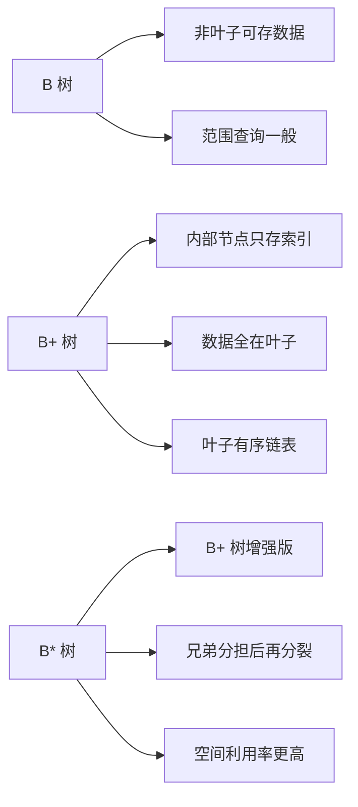
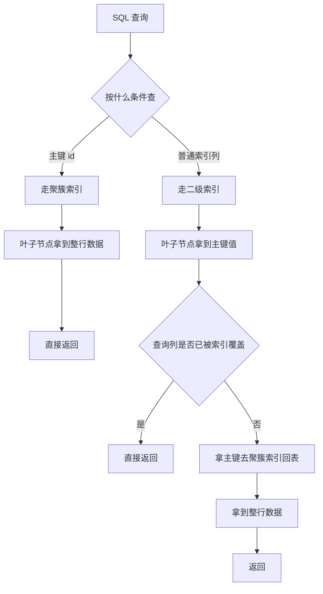

# MySQL 复习知识文档

这份文档只保留面试高频内容，目标是“够用、好背、能速看”。

## 一、面试重点只看这些

1. 索引为什么快，为什么是 B+ 树。
2. 聚簇索引、二级索引、回表、覆盖索引。
3. 联合索引最左匹配。
4. ACID、隔离级别、脏读/不可重复读/幻读。
5. MVCC 是什么，有什么用。
6. 慢 SQL 怎么排查。
7. 高并发下数据库压力怎么处理。
8. 信创迁移后为什么可能变慢。

## 二、核心知识

### 1. 索引

一句话：

“索引本质是帮助数据库快速定位数据的数据结构，InnoDB 主要使用 B+ 树索引。”

为什么 B+ 树快：

1. 多叉树，树更矮，磁盘 IO 更少。
2. 更适合磁盘页读取。
3. 叶子节点有序，范围查询效率高。

展开一点理解：

1. 索引快，不是因为“比较次数绝对最少”，而是因为它尽量减少了最贵的磁盘随机 IO。
2. 数据库一次磁盘读取往往按“页”读取，InnoDB 默认页大小一般是 `16KB`，一个页里能放很多键。
3. B+ 树是多路平衡查找树，一个节点可以有很多孩子，所以同样的数据量下树高很低。
4. 树高低意味着从根节点走到叶子节点需要访问的页更少，通常只要 `2~4` 层就能命中大量数据。
5. 叶子节点天然按 key 有序，并且叶子之间通常通过链表相连，所以范围查询、排序、分页都很友好。
6. 相比哈希结构，B+ 树不仅能做等值查找，还能高效处理 `>、<、between、order by`。

一个常见的面试回答可以这样说：

“索引之所以快，核心是用空间换时间。B+ 树把数据组织成多叉平衡树结构，一个磁盘页能放很多索引项，所以树高很低；查找时能把磁盘 IO 次数控制得很少。并且 B+ 树叶子节点天然有序，范围查询、排序和分页都很高效，所以数据库最终选择 B+ 树，而不是普通二叉树、红黑树或者哈希表作为通用索引结构。”

#### B 树、B+ 树、B* 树的区别

先说结论：

1. `B 树`：非叶子节点和叶子节点都可以存数据。
2. `B+ 树`：非叶子节点只存 key 和指针，真正的数据只放在叶子节点。
3. `B* 树`：可以看成是对 B+ 树的进一步优化，节点更“满”，空间利用率更高，分裂更晚。

#### 三种树的结构特性

| 结构 | 非叶子节点存什么 | 叶子节点存什么 | 叶子是否链起来 | 范围查询 | 空间利用率 |
| --- | --- | --- | --- | --- | --- |
| B 树 | `key + data + child` | `key + data` | 通常不强调 | 一般 | 较高 |
| B+ 树 | `key + child` | 全部 `key + data` | 是 | 很强 | 高 |
| B* 树 | `key + child` | 全部 `key + data` | 是 | 很强 | 更高 |

#### 三种树的典型约束

说明：不同教材对“阶”的定义略有差异，面试里说清楚“孩子数范围、关键字数范围、是否所有叶子同层”就够了。

**1. B 树（B-Tree）**

1. 所有叶子节点都在同一层。
2. 每个节点最多有 `m` 个孩子。
3. 除根节点外，每个非叶子节点至少有 `ceil(m/2)` 个孩子。
4. 一个有 `k` 个孩子的节点，通常有 `k-1` 个关键字。
5. 非叶子节点本身也保存数据记录或记录地址。

**2. B+ 树（B+ Tree）**

1. 所有叶子节点都在同一层。
2. 每个节点最多有 `m` 个孩子。
3. 除根节点外，每个内部节点至少有 `ceil(m/2)` 个孩子。
4. 内部节点只做索引导航，不存真实数据。
5. 所有数据都在叶子节点，叶子节点之间按 key 顺序连接成链表。
6. 内部节点的 key 可以理解成“分隔值”或“目录项”。

**3. B* 树（B* Tree）**

1. 可以视为 B+ 树的增强版，叶子节点同样在同一层，数据也主要放在叶子。
2. 节点满了时，不急着立刻一分为二，而是优先和兄弟节点重新分配。
3. 只有兄弟节点也满了，才会分裂成三个节点。
4. 因为分裂更晚，所以节点最小装载率通常更高，常见描述是至少约 `2/3` 满。
5. 相比 B+ 树，它的空间利用率更高，树可能更矮一点。

#### 为什么数据库更偏向 B+ 树，而不是 B 树

1. **单个节点能放更多 key**
   因为 B+ 树内部节点不存 data，只存 key 和指针，所以同样一个页里能容纳更多索引项，分叉更多，树更矮。
2. **查询路径更稳定**
   B 树可能在非叶子节点提前命中，查找路径长度不一致；B+ 树总是走到叶子节点，性能更稳定，更利于数据库做统一预估。
3. **范围查询明显更强**
   B+ 树叶子节点有序且相连，找到起点后顺链表扫即可；B 树做范围扫描时，需要反复做中序遍历，局部性更差。
4. **更适合磁盘和页管理**
   数据库按页加载，B+ 树内部节点更像“稀疏目录”，叶子节点更像“数据页索引”，结构更贴合存储系统。

#### 为什么不是二叉树、AVL、红黑树、哈希

1. 二叉树、AVL、红黑树都是“低扇出”结构，树会更高，磁盘 IO 次数更多。
2. 哈希只擅长等值查询，不擅长范围查询、排序、最左匹配。
3. 数据库的核心目标不是纯内存比较次数最少，而是减少页读取、提高顺序访问效率。

#### 图片示例 1：B 树

```text
                [17 | 35]
               /    |    \
      [5 | 9 | 12] [20 | 28] [40 | 50]

说明：
1. 每个节点里既有 key，也可能直接挂 data。
2. 查到非叶子节点就可能结束。
3. 数据分散在整棵树上。
```

#### 图片示例 2：B+ 树

```text
                [17 | 35]
               /    |    \
         [5|9|12] [17|20|28] [35|40|50]
            |          |           |
      +-----+----------+-----------+---->
      叶子节点按顺序链接

说明：
1. 上层节点只存索引，不存真实数据。
2. 所有真实数据都在叶子节点。
3. 做范围查询时，从起点叶子一路往后扫即可。
```

#### 图片示例 3：B* 树

```text
                [17 | 35]
               /    |    \
      [5|9|12|15] [17|20|28|30] [35|40|50|60]
           <------ 兄弟节点优先借位/重分配 ------>

说明：
1. 节点满时，先看兄弟节点能不能一起分担。
2. 兄弟也满了才分裂，因此节点通常更满。
3. 空间利用率比 B+ 树更高。
```

#### 一张图记住三者



#### 面试里怎么收口

可以直接这样答：

“索引快的本质是减少磁盘 IO。B+ 树是多叉平衡树，一个节点能放很多 key，所以树高很低；并且内部节点只存索引，叶子节点顺序相连，既能做高效单点查询，也特别适合范围查询、排序和分页。B 树虽然也能查，但数据分布在整棵树上；B* 树是 B+ 树的优化版，节点利用率更高。不过数据库实现里最经典、最常见的还是 B+ 树。”

### 2. 聚簇索引和二级索引

1. 聚簇索引：主键索引，叶子节点存整行数据。
2. 二级索引：叶子节点存索引列 + 主键值。

怎么理解这两个结构：

1. **聚簇索引** 的叶子节点就是“数据本身”，所以通过主键查数据时，查到叶子节点就拿到整行了。
2. **二级索引** 的叶子节点不是整行数据，而是“索引列值 + 主键值”。
3. 所以通过普通索引查询时，先在二级索引里找到主键，再拿主键去聚簇索引里找整行，这一步就叫 **回表**。
4. 如果查询的列刚好都在二级索引里，就不需要再回到聚簇索引取整行，这就是 **覆盖索引**。

可以直接记成一句：

“主键索引的叶子节点存整行，普通索引的叶子节点存主键；所以主键查询一般一步到位，普通索引查询可能要先定位主键，再回表查数据。”

#### 查询逻辑 1：按主键查询（走聚簇索引）

例如：

```sql
select * from user where id = 100;
```

流程：

1. 从聚簇索引根节点开始查找。
2. 经过若干层内部节点定位到叶子节点。
3. 叶子节点里就是完整行记录。
4. 直接返回结果，不需要回表。

```text
select * from user where id = 100
                |
                v
        聚簇索引 Root Page
                |
                v
        聚簇索引 Internal Page
                |
                v
        聚簇索引 Leaf Page
                |
                v
      命中整行数据 (id=100, name, age, ...)
                |
                v
              返回
```

#### 查询逻辑 2：按二级索引查询，需要回表

例如：

```sql
select * from user where name = 'Alice';
```

假设 `name` 上有普通索引。

流程：

1. 先从 `name` 二级索引的根节点开始查。
2. 在二级索引叶子节点找到 `name='Alice'` 对应的主键值，比如 `id=100`。
3. 再拿这个 `id=100` 去聚簇索引里查。
4. 在聚簇索引叶子节点拿到整行数据。
5. 返回结果。

```text
select * from user where name = 'Alice'
                  |
                  v
           二级索引 Root Page
                  |
                  v
         二级索引 Internal Page
                  |
                  v
           二级索引 Leaf Page
                  |
                  v
      命中 (name='Alice', id=100)
                  |
                  v
          拿主键 id=100 回表
                  |
                  v
           聚簇索引 Root Page
                  |
                  v
         聚簇索引 Internal Page
                  |
                  v
           聚簇索引 Leaf Page
                  |
                  v
     命中整行数据 (id=100, name, age, ...)
                  |
                  v
                返回
```

#### 查询逻辑 3：按二级索引查询，但命中覆盖索引

例如：

```sql
select name from user where name = 'Alice';
```

流程：

1. 先查 `name` 二级索引。
2. 在叶子节点已经能拿到查询需要的列。
3. 不需要再去聚簇索引查整行。
4. 直接返回。

```text
select name from user where name = 'Alice'
                  |
                  v
           二级索引 Root Page
                  |
                  v
         二级索引 Internal Page
                  |
                  v
           二级索引 Leaf Page
                  |
                  v
          命中需要的列 name
                  |
                  v
         直接返回，不需要回表
```

#### 查询逻辑 4：主键索引和二级索引的本质差异



#### 面试里怎么讲查询流程

可以直接这样说：

“聚簇索引的叶子节点存的是整行数据，所以按主键查时，找到叶子节点就结束了。二级索引的叶子节点存的是索引列值和主键值，所以按普通索引查时，通常先在二级索引里找到主键，再去聚簇索引里查整行，这就是回表。如果查询列本身就在二级索引里，就可以直接返回，这就是覆盖索引。”

### 3. 回表和覆盖索引

1. 回表：先查二级索引，再根据主键去主键索引查整行。
2. 覆盖索引：查询列都能直接从索引里拿到，不需要回表。

一句话：

“覆盖索引的核心价值是减少回表，提高查询效率。”

### 4. 最左匹配

联合索引从左往右生效。

例如：

```sql
index(a, b, c)
```

常见可命中：

1. `where a = 1`
2. `where a = 1 and b = 2`
3. `where a = 1 and b = 2 and c = 3`

常见不容易命中：

1. `where b = 2`
2. `where c = 3`

### 5. 事务和隔离级别

先记一句：

事务就是一组操作，要么全部成功，要么全部失败。

例如转账：

1. A 账户扣 100
2. B 账户加 100

这两个动作必须是一个整体，不能只成功一半。

ACID：

1. 原子性：要么都成功，要么都失败。
2. 一致性：事务前后数据状态合法。
3. 隔离性：并发事务互不干扰。
4. 持久性：提交后数据不丢。

#### ACID 怎么理解

1. 原子性：事务不能只做一半，失败就整体回滚。
2. 一致性：事务执行前后，数据库都要处于正确状态。
3. 隔离性：多个事务并发执行时，彼此尽量不要互相影响。
4. 持久性：事务一旦提交成功，即使宕机，结果也不能丢。

转账场景里可以这样理解：

1. 原子性：扣钱和加钱要么一起成功，要么一起失败。
2. 一致性：转账前后总金额应该保持一致。
3. 隔离性：别的事务不应该看到“只扣钱还没加钱”的中间状态。
4. 持久性：提交后即使数据库重启，转账结果也还在。

面试里可以直接这样答：

“事务是数据库中的一个逻辑操作单元，由一组 SQL 组成，这组操作要么全部成功并提交，要么全部失败并回滚。事务的核心特性是 ACID，也就是原子性、一致性、隔离性、持久性。”

并发问题：

1. 脏读：读到未提交数据。
2. 不可重复读：同一行两次读取结果不同。
3. 幻读：同样条件两次查询，记录数不同。

常见隔离级别：

1. `Read Uncommitted`
2. `Read Committed`
3. `Repeatable Read`
4. `Serializable`

InnoDB 默认是 `Repeatable Read`。

### 6. MVCC

一句话：

“MVCC 是多版本并发控制，它通过历史版本让普通读尽量不加锁，从而减少读写冲突。”

你面试里理解到这三个关键词就够用：

1. undo log
2. Read View
3. 可见性判断

### 7. 慢 SQL 优化

排查顺序：

1. 先看 `explain`
2. 看有没有命中索引
3. 看扫描行数是不是太大
4. 看有没有回表、排序、临时表
5. 看有没有锁等待、大事务

常见优化手段：

1. 建合适索引
2. 尽量走覆盖索引
3. 避免 `select *`
4. 批量写入
5. 拆大事务
6. 热点数据上缓存

### 8. 高并发下数据库压力怎么处理

答题顺序建议：

1. 先做索引和 SQL 优化
2. 再做批量写入、缩短事务
3. 再考虑缓存、MQ 削峰
4. 最后才是读写分离、分库分表

这样答会更像工程思路，而不是一上来就“分库分表”。

### 9. 信创迁移常见关注点

你结合简历可以重点答这几类：

1. SQL 语法兼容差异
2. 驱动和连接参数差异
3. 执行计划差异
4. 事务和锁行为差异
5. 同样 SQL 在新库上性能不一定一样

如果迁移后变慢，优先看：

1. 执行计划有没有变化
2. 索引有没有命中
3. 是否回表变多
4. 是否锁等待增加
5. 驱动和连接池参数是否合理

## 三、常用语法速查

### 1. 基本语法骨架

```sql
select 列名
from 表名
join 表名 on 连接条件
where 条件
group by 分组字段
having 分组后的条件
order by 排序字段
limit 起始位置, 返回行数;
```

速记：

1. `SELECT`：查哪些列。
2. `FROM`：先确定从哪些表里取数据。
3. `JOIN ... ON ...`：在 `FROM` 阶段完成表关联和匹配。
4. `WHERE`：先过滤行。
5. `GROUP BY`：再分组。
6. `HAVING`：对分组后的结果再过滤。
7. `ORDER BY`：最后排序。
8. `LIMIT`：最后取部分结果。

补一句：

`JOIN` 可以理解成属于 `FROM` 过程的一部分，先把表之间的匹配关系确定下来，再进入 `WHERE`、`GROUP BY`、`HAVING` 这些阶段。

实际逻辑执行顺序可以记成：

`FROM -> JOIN -> ON -> WHERE -> GROUP BY -> HAVING -> SELECT -> ORDER BY -> LIMIT`

说明：

1. `FROM`：先确定基础表。
2. `JOIN`：如果有多表，开始做表关联。
3. `ON`：确定表之间哪些行能匹配上。
4. `WHERE`：对匹配后的明细行先过滤。
5. `GROUP BY`：把过滤后的结果分组。
6. `HAVING`：对分组后的结果再过滤。
7. `SELECT`：决定最终取哪些列、做哪些表达式计算。
8. `ORDER BY`：对最终结果排序。
9. `LIMIT`：最后截取部分结果。

一句话背诵：

先组装数据，再过滤，再分组，再对分组结果过滤，最后取列、排序、分页。

常见示例：

```sql
select city, count(*)
from user u
left join orders o on u.id = o.user_id
where status = 1
group by city
having count(*) > 10
order by count(*) desc
limit 0, 5;
```

### 2. 基本查询

```sql
select * from user;
select id, name from user;
select distinct city from user;
```

### 3. 条件过滤

```sql
select * from user where id = 1;
select * from user where age > 18;
select * from user where age between 18 and 30;
select * from user where city in ('beijing', 'shanghai');
select * from user where name like 'zhang%';
select * from user where phone is null;
```

### 4. 排序和分页

```sql
select * from user order by age desc;
select * from user limit 10;
select * from user limit 20, 10;
```

### 5. 聚合函数

```sql
select count(*) from user;
select max(age) from user;
select min(age) from user;
select avg(age) from user;
select sum(score) from user;
```

### 6. 分组

```sql
select city, count(*) from user group by city;
select city, count(*) from user group by city having count(*) > 10;
```

### 7. 连接查询

```sql
select u.id, u.name, o.id
from user u
inner join orders o on u.id = o.user_id;

select u.id, u.name, o.id
from user u
left join orders o on u.id = o.user_id;

select u.id, u.name, o.id
from user u
right join orders o on u.id = o.user_id;
```

#### JOIN 速记

一句话先记住：

`ON` 是定义怎么匹配，`WHERE` 是定义最终结果留不留。

| 连接类型 | 语法示意 | 作用 | 没匹配上的表现 |
| --- | --- | --- | --- |
| `INNER JOIN` | `A inner join B on A.id = B.a_id` | 只保留两边都能匹配上的行 | 左右没匹配上的都丢掉 |
| `LEFT JOIN` | `A left join B on A.id = B.a_id` | 左表全保留，右表按条件补充 | 右表补 `NULL` |
| `RIGHT JOIN` | `A right join B on A.id = B.a_id` | 右表全保留，左表按条件补充 | 左表补 `NULL` |
| `FULL OUTER JOIN` | `A full outer join B on A.id = B.a_id` | 左右都保留 | 哪边没匹配上，哪边补 `NULL` |

说明：

1. MySQL 不原生支持 `FULL OUTER JOIN`，一般用 `left join + union + right join` 模拟。
2. `LEFT JOIN` 的核心承诺是：左表每一行至少出现一次。
3. `RIGHT JOIN` 的核心承诺是：右表每一行至少出现一次。

#### ON 和 WHERE 的区别

| 写法 | 含义 | 对 `LEFT JOIN` 的影响 |
| --- | --- | --- |
| 条件写在 `ON` | 影响两张表能不能匹配上 | 不会破坏左表全保留，匹配失败时右表补 `NULL` |
| 条件写在 `WHERE` | 对 join 后的结果再过滤 | 可能把右表为 `NULL` 的行过滤掉，效果接近 `INNER JOIN` |

代码对比：

```sql
-- 写在 ON：左表仍然全保留
select *
from A
left join B
  on A.id = B.a_id
 and B.score > 80;

-- 写在 WHERE：会过滤掉右表为 NULL 的行
select *
from A
left join B
  on A.id = B.a_id
where B.score > 80;
```

#### JOIN 结果为什么会变多

1. `JOIN` 会保留所有满足 `ON` 条件的组合，不是只挑一条。
2. 如果一边不唯一，就可能出现一对多。
3. 如果两边都不唯一，就可能出现多对多，结果行数膨胀。

例如：

```sql
select *
from A
left join B on A.id = B.a_id;
```

如果 `A.id = 1` 有两行，`B.a_id = 1` 也有两行，结果会展开成 `2 x 2 = 4` 行。

#### JOIN 的执行流程

面试里可以先这么说：

1. MySQL 做 join 时，通常会先确定一张表作为驱动表。
2. 先从驱动表取一行，再去另一张表里找满足 `ON` 条件的记录。
3. 找到就拼接成结果，找不到则看是不是外连接，外连接会补 `NULL`。
4. 然后继续处理驱动表的下一行，直到结束。

代码示意：

```sql
select *
from user u
left join orders o on u.id = o.user_id;
```

可以粗略理解成：

```text
1. 先从 user 表取一行
2. 去 orders 表找 user_id = u.id 的记录
3. 找到就拼起来
4. 找不到，因为是 left join，所以 orders 一侧补 NULL
5. 继续处理 user 表下一行
```

#### 驱动表和被驱动表

| 概念 | 含义 | 怎么理解 |
| --- | --- | --- |
| 驱动表 | 先被扫描、先出记录的表 | 它的一行一行去“驱动”后面的匹配动作 |
| 被驱动表 | 根据驱动表的值去匹配的表 | 它通常要根据关联列快速查找 |

常见理解：

1. `nested-loop join` 可以理解成“外层一行一行取，内层跟着查”。
2. 驱动表如果返回很多行，后面的匹配次数就会明显增多。
3. 所以 join 优化时，既要看关联列有没有索引，也要看谁做驱动表更合适。

#### 驱动表到底由什么决定

一句话先记：

不是只看谁写在前面，最终看优化器的执行计划。

可以分三点理解：

1. 连接方式会影响驱动方向。`LEFT JOIN` 通常以左表语义为主，`RIGHT JOIN` 通常以右表语义为主，`INNER JOIN` 优化器更灵活。
2. SQL 的书写顺序会影响候选顺序，但不代表一定按这个顺序执行。
3. 最终谁做驱动表，要结合表大小、过滤条件、索引情况和优化器成本评估一起看。

例如：

```sql
select *
from A
inner join B on A.id = B.a_id;
```

这不代表一定先扫 `A` 再扫 `B`，`INNER JOIN` 下优化器可能调整访问顺序。

面试里可以这样回答：

“驱动表不是单纯由哪张表写在前面决定，而是主要取决于优化器的执行计划。不过外连接会限制一定的方向，比如 `LEFT JOIN` 通常以左表为主，`RIGHT JOIN` 通常以右表为主；而 `INNER JOIN` 下优化器会结合索引、过滤条件和成本选择更合适的驱动表。”

#### EXPLAIN 里 `ref` 和 `eq_ref` 在 join 里的含义

| `type` | 含义 | 常见场景 | 怎么理解 |
| --- | --- | --- | --- |
| `eq_ref` | join 时通过主键或唯一索引做等值匹配 | 被驱动表关联列是主键或唯一索引 | 前表一行，当前表最多命中一行 |
| `ref` | join 时通过普通索引做等值匹配 | 被驱动表关联列是普通索引 | 前表一行，当前表可能命中多行 |

代码示意 1：`eq_ref`

```sql
select *
from orders o
join user u on o.user_id = u.id;
```

如果 `u.id` 是主键，那么访问 `u` 时常见是 `eq_ref`。

代码示意 2：`ref`

```sql
select *
from class c
join student s on c.id = s.class_id;
```

如果 `s.class_id` 只是普通索引，不唯一，那么访问 `s` 时更常见是 `ref`。

一句话记：

1. `eq_ref`：等值连表 + 唯一索引，每次最多匹配一行。
2. `ref`：等值连表 + 普通索引，每次可能匹配多行。
3. 一般来说，`eq_ref` 比 `ref` 更优。

### 8. 插入、更新、删除

```sql
insert into user(id, name, age) values(1, 'tom', 20);

update user
set age = 21
where id = 1;

delete from user
where id = 1;
```

### 9. `DELIMITER`

一句话：

`DELIMITER` 用来修改客户端识别 SQL 结束的分隔符，常见于存储过程、函数、触发器定义。

为什么要改：

1. MySQL 客户端默认把 `;` 当成一条 SQL 的结束标记。
2. 但存储过程、函数、触发器内部本身也会写很多 `;`。
3. 如果不改分隔符，客户端会误以为过程还没写完就结束了。

常见写法：

```sql
delimiter $$

create procedure p_test()
begin
    select * from user;
    select count(*) from user;
end $$

delimiter ;
```

怎么理解：

1. `delimiter $$` 表示临时把结束符改成 `$$`。
2. 这样过程体内部的 `;` 只表示语句结束，不表示整个 `create procedure` 结束。
3. 最后再用 `delimiter ;` 改回默认分隔符。

补一句：

`DELIMITER` 更准确地说是客户端命令，不是 MySQL SQL 语法关键字本身。

### 10. 去重、排序、分组执行顺序

常见逻辑顺序可以记成：

`from -> where -> group by -> having -> select -> distinct -> order by -> limit`

### 11. 索引相关语法

```sql
create index idx_user_name on user(name);
create index idx_user_name_age on user(name, age);
drop index idx_user_name on user;
show index from user;
```

### 12. 执行计划（EXPLAIN）

```sql
explain select * from user where name = 'tom';
```

#### EXPLAIN 的作用

`EXPLAIN` 的本质是让 MySQL 告诉你：“这条 SQL 我打算怎么执行。”

你可以把它理解成 SQL 的“执行计划预览”。

它主要用来做三件事：

1. 看这条 SQL 有没有走索引。
2. 看优化器最终选择了哪个索引、哪种访问方式。
3. 看扫描行数大不大，是否有回表、排序、临时表、全表扫描等风险。

一句话记忆：

“`EXPLAIN` 不直接告诉你 SQL 一定慢在哪里，但它能告诉你 SQL 准备怎么跑，从而帮你判断问题大概率出在哪。”

#### EXPLAIN 返回结果里常见字段有什么意义

面试和排查里最常看的是：`type`、`key`、`rows`、`Extra`。

| 字段 | 含义 | 常见值/说明 | 怎么解读 |
| --- | --- | --- | --- |
| `id` | 查询中每个 `select` 的标识，通常可理解为执行层级 | `id` 越大通常越先执行；相同 `id` 一般属于同一层 | 有子查询、派生表、`union` 时尤其值得看 |
| `select_type` | 当前查询的类型 | `SIMPLE`、`PRIMARY`、`SUBQUERY`、`DERIVED`、`UNION` | 用来看这一步是普通查询、外层查询还是子查询/派生表 |
| `table` | 当前访问的是哪张表 | 单表时比较直观；多表时会出现多行 | 多表 join 时可以帮助判断表访问顺序 |
| `type` | 访问类型，也就是 MySQL 以什么方式找数据 | 常见优劣顺序：`system > const > eq_ref > ref > range > index > ALL` | 越靠左通常越好；`index`、`ALL` 要重点警惕 |
| `possible_keys` | 理论上可能使用的索引 | 只是候选索引列表 | 有候选但没真正使用，还要继续看 `key` |
| `key` | 实际使用的索引 | 可能是某个索引名，也可能是 `NULL` | `NULL` 常表示没走索引；命中预期索引通常是好事 |
| `key_len` | 本次实际使用的索引长度 | 常用于联合索引分析 | 可以辅助判断联合索引到底用了几列 |
| `ref` | 索引列和谁做比较 | 常见是 `const` 或其他表字段 | 可判断这一步是“索引列 = 常量”还是“索引列 = 另一列” |
| `rows` | 预估要扫描的行数 | 数值越大，通常代价越高 | 这是判断 SQL 是否可能慢的重点字段 |
| `filtered` | 经过条件过滤后预计还能保留的比例 | 一般是百分比 | 用来辅助判断过滤效果，复杂 SQL 中更有参考价值 |
| `Extra` | 执行细节补充 | 常见有 `Using index`、`Using where`、`Using temporary`、`Using filesort` | 用来看是否覆盖索引、是否有临时表、额外排序、join buffer 等风险 |

#### 字段里哪些最值得优先看

1. `type`：先判断是不是全表扫描，或者只是范围扫描。
2. `key`：看最终有没有走到你预期的索引。
3. `rows`：看扫描量大不大，这个非常关键。
4. `Extra`：看有没有 `Using filesort`、`Using temporary`、`Using index`。
5. `key_len`：联合索引场景下，再看它到底用了几列。

#### `type` 常见值怎么快速记

| `type` 值 | 含义 | 一般怎么判断 |
| --- | --- | --- |
| `const` | 主键或唯一索引等值命中一条记录 | 很好，通常是高效点查 |
| `eq_ref` | join 时用唯一索引做等值匹配 | 很好，常见于高质量关联 |
| `ref` | 普通索引等值查询 | 常见，可接受 |
| `range` | 索引范围扫描 | 常见，可接受，要结合 `rows` 看 |
| `index` | 全索引扫描 | 不一定好，说明虽然用了索引，但扫描范围仍大 |
| `ALL` | 全表扫描 | 风险最大，通常优先排查 |

#### `Extra` 常见值怎么快速记

| `Extra` 值 | 含义 | 一般怎么判断 |
| --- | --- | --- |
| `Using index` | 覆盖索引 | 通常是好信号 |
| `Using where` | 取到记录后还要再过滤 | 很常见，不一定有问题 |
| `Using index condition` | 使用了索引条件下推 | 一般偏好 |
| `Using temporary` | 用了临时表 | 要重点关注 |
| `Using filesort` | 需要额外排序 | 要重点关注 |
| `Using join buffer` | join 没很好命中索引 | 要重点关注 |

#### 我如何解读 EXPLAIN：推荐顺序

拿到执行计划后，我建议按这个顺序看：

1. **先看 `table` 和 `id`**
   先搞清楚 SQL 在访问哪些表，谁先谁后。
2. **再看 `type`**
   判断是主键点查、索引等值查、范围查，还是全表扫描。
3. **再看 `key` 和 `possible_keys`**
   看有没有可选索引，实际用了哪个索引，是不是你预期的索引。
4. **再看 `key_len`**
   判断联合索引到底用了几列，是否只用到了最左前缀。
5. **重点看 `rows`**
   判断扫描行数是否过大，这是慢 SQL 的核心信号。
6. **最后看 `Extra`**
   重点关注有没有 `Using temporary`、`Using filesort`、是否覆盖索引、是否回表风险高。

#### 一套实战判断口诀

可以直接背：

“先看走没走索引，再看走的是不是对的索引；再看扫描行数大不大；最后看有没有临时表、额外排序、回表和 join buffer。”

#### 一个简单例子怎么读

```sql
explain select * from user where name = 'tom';
```

假设返回关键信息是：

| key | type | rows | Extra |
| --- | --- | --- | --- |
| idx_user_name | ref | 10 | Using where |

可以这样解读：

1. `key = idx_user_name`：说明实际用了 `name` 索引。
2. `type = ref`：说明是基于普通索引的等值查询，属于比较常见且可接受的方式。
3. `rows = 10`：说明预估只扫描 10 行，扫描量不大。
4. `Extra = Using where`：说明命中索引后还会再做条件过滤，但这本身并不一定有问题。

如果返回的是这种：

| key | type | rows | Extra |
| --- | --- | --- | --- |
| NULL | ALL | 500000 | Using where |

那就要警惕：

1. `key = NULL`：没用索引。
2. `type = ALL`：全表扫描。
3. `rows = 500000`：扫描量很大。
4. 这类 SQL 通常就是重点优化对象。

#### 面试里怎么回答 EXPLAIN 的作用

可以直接这样说：

“`EXPLAIN` 用来查看 SQL 的执行计划，本质是看 MySQL 准备怎么执行这条语句。排查时我会重点看 `type`、`key`、`rows`、`Extra`。先判断有没有走索引、走的是不是合适的索引，再看扫描行数大不大，最后看有没有 `Using temporary`、`Using filesort`、覆盖索引、回表等信息，从而定位 SQL 慢在扫描、排序、回表还是关联上。”

#### EXPLAIN 字段速查表

| 字段 | 作用 | 重点怎么看 | 风险信号 |
| --- | --- | --- | --- |
| `id` | 标识查询层级和大致执行顺序 | `id` 越大通常越先执行；相同 `id` 属于同一层 | 子查询很多、层级很深时要留意复杂度 |
| `select_type` | 查询类型 | 看是否是 `SIMPLE`、`PRIMARY`、`SUBQUERY`、`DERIVED` | `DERIVED`、复杂子查询较多时要多留意 |
| `table` | 当前访问的表 | 看多表 join 时访问了哪些表 | 大表如果被放在不合适的驱动位置，可能变慢 |
| `type` | 访问方式 | 优先希望看到 `const`、`eq_ref`、`ref`、`range` | `index`、`ALL` 需要重点警惕 |
| `possible_keys` | 理论可选索引 | 看优化器有没有候选索引可用 | 为空时可能说明条件上没有合适索引 |
| `key` | 实际使用的索引 | 看是否命中预期索引 | `NULL` 说明没走索引 |
| `key_len` | 实际使用的索引长度 | 常用来判断联合索引用到了几列 | 联合索引没充分利用时要关注 |
| `ref` | 索引列和谁比较 | 常见是 `const` 或其他表字段 | join 时如果关联列不理想，要继续排查 |
| `rows` | 预估扫描行数 | 越小通常越好，是重点字段 | 行数特别大通常意味着慢 SQL 风险高 |
| `filtered` | 过滤后剩余比例 | 辅助看过滤效果 | 比例异常时说明过滤效率可能一般 |
| `Extra` | 执行细节补充 | 看是否有覆盖索引、排序、临时表、join buffer | `Using filesort`、`Using temporary`、`Using join buffer` 要重点关注 |

#### `Extra` 常见值速查

| Extra 值 | 一般含义 | 通常是好是坏 | 常见处理思路 |
| --- | --- | --- | --- |
| `Using index` | 覆盖索引，查询列都能从索引中取到 | 通常是好信号 | 尽量保留这种访问方式 |
| `Using where` | 取到记录后还要再做条件过滤 | 中性，常见 | 结合 `type`、`rows` 一起判断 |
| `Using index condition` | 使用索引条件下推（ICP） | 一般偏好 | 通常不用单独处理 |
| `Using temporary` | 用了临时表 | 通常要关注 | 检查 `group by`、`distinct`、`order by` 和索引设计 |
| `Using filesort` | 不能直接利用索引完成排序 | 通常要关注 | 检查排序字段、where 条件和联合索引 |
| `Using join buffer` | join 没很好命中索引 | 通常要关注 | 给关联列加索引，优化驱动表和 join 顺序 |

#### `Using filesort` / `Using temporary` 怎么优化

这两个词经常一起出现，也是面试里很常被追问的点。

| 现象 | 代表什么 | 常见原因 | 优化方向 | 例子 |
| --- | --- | --- | --- | --- |
| `Using filesort` | 排序没能直接利用索引 | `order by` 字段没有合适索引；排序方向不一致；where 和 order by 没对齐 | 让 `where + order by` 尽量命中同一个联合索引；减少无意义排序；避免大结果集排序 | 给 `where status = ? order by create_time` 建 `(status, create_time)` |
| `Using temporary` | MySQL 需要先把中间结果放进临时表再处理 | `group by`、`distinct`、复杂排序、多表 join 后再聚合 | 让分组列、筛选列尽量匹配索引；先缩小结果集再聚合；必要时改写 SQL | 给 `group by dept_id` 配合 `where status = 1` 建 `(status, dept_id)` |
| `Using filesort + Using temporary` 同时出现 | 先生成中间结果，再额外排序，代价更高 | 聚合、排序、去重都没很好利用索引 | 优先优化索引顺序，减少参与排序和聚合的数据量 | 常见于 `group by ... order by ...` 不走索引 |

#### 出现 `Using filesort` 时，我一般怎么想

1. 先看 `order by` 的字段有没有索引。
2. 再看排序字段和 `where` 条件是否能共同命中联合索引。
3. 再看排序方向是否一致，比如联合索引和排序方向是否匹配。
4. 如果结果集本来就很大，要先想办法缩小扫描范围，而不是只盯着排序本身。
5. 如果只是偶尔小数据量排序，`Using filesort` 不一定就是严重问题，要结合 `rows` 看。

#### 出现 `Using temporary` 时，我一般怎么想

1. 先看是不是有 `group by`、`distinct`、复杂 `order by`。
2. 再看分组字段、过滤字段有没有合理索引。
3. 想办法让 SQL 先过滤，再聚合，而不是先扫大批数据再分组。
4. 多表 join 场景下，要看是不是 join 之后的数据量膨胀了。
5. 如果业务允许，可以拆 SQL 或提前做汇总，减少在线聚合压力。

#### 一个很实用的判断原则

1. 只有 `Using where`，不一定有问题。
2. `Using index` 往往是好信号。
3. `Using filesort` 要先看是不是排序没走索引。
4. `Using temporary` 要先看是不是分组、去重、排序导致的中间结果过大。
5. 判断严重不严重，最终还是要结合 `type`、`rows`、实际耗时一起看。

#### 面试里怎么回答 `Using temporary` / `Using filesort` 的优化

可以直接这样答：

“如果 `EXPLAIN` 出现 `Using filesort`，我会先看排序字段有没有索引，以及 `where` 和 `order by` 能不能共同命中联合索引；如果出现 `Using temporary`，我会重点看 `group by`、`distinct`、多表 join 后聚合这些场景，尽量让筛选列、分组列、排序列和索引顺序对齐。整体思路是减少扫描行数、减少中间结果、尽量利用索引直接完成分组和排序。” 

#### 一句总思路

`Using temporary` 和 `Using filesort` 的优化核心，不是盯着现象本身，而是想办法让 MySQL 尽量顺着索引把数据直接取出来，少做中间表、少做额外排序。

## 四、高频速答

### 1. MySQL 索引为什么快

“因为 InnoDB 用 B+ 树。它是多叉平衡树，单个节点能放很多 key，所以树高低、磁盘 IO 少；同时叶子节点有序并且相连，特别适合范围查询、排序和分页。”

### 2. 什么是回表

“先查二级索引，再根据主键去聚簇索引查整行。”

### 3. 什么是覆盖索引

“查询列都能从索引中直接取到，不需要回表。”

### 4. 什么是最左匹配

“联合索引从最左列开始生效，不能跳过左边字段直接用右边字段。”

### 5. MVCC 是什么

“MVCC 是多版本并发控制，通过历史版本减少读写冲突。”

### 6. 慢 SQL 怎么排查

“先看 `explain`，再看索引、扫描行数、回表、排序、临时表和锁等待。”

### 7. 高并发下数据库压力怎么处理

“先优化索引和 SQL，再做批量写入、缓存、削峰，最后再考虑读写分离或分库分表。”

### 8. INNER JOIN、LEFT JOIN、RIGHT JOIN 有什么区别

“`INNER JOIN` 只保留匹配上的行；`LEFT JOIN` 保留左表全部行，右表匹配不上就补 `NULL`；`RIGHT JOIN` 保留右表全部行，左表匹配不上就补 `NULL`。在 `LEFT JOIN` 里，`ON` 是匹配条件，`WHERE` 是结果过滤，右表条件乱写到 `WHERE` 容易把左连接写成类似内连接。” 

### 9. JOIN 的执行流程、驱动表、`eq_ref`、`ref` 怎么理解

“join 可以先理解成：先确定驱动表，驱动表先出一行，再去被驱动表里按 `ON` 条件查匹配记录。`eq_ref` 表示通过主键或唯一索引做等值关联，每次最多命中一行；`ref` 表示通过普通索引做等值关联，每次可能命中多行。优化 join 时要重点看关联列索引和驱动表行数。” 

### 10. 驱动表是由连接方式决定，还是由表顺序决定

“都有关，但最终看执行计划。外连接会限制一定方向，比如 `LEFT JOIN` 常以左表为主；`INNER JOIN` 下优化器更自由，不一定按你写的表顺序执行，而是结合索引、过滤条件和成本选择驱动表。” 

## 五、临考前只背这几句

1. InnoDB 索引核心是 B+ 树。
2. 主键索引是聚簇索引，普通索引一般是二级索引。
3. 覆盖索引减少回表，联合索引注意最左匹配。
4. InnoDB 默认隔离级别是 `Repeatable Read`。
5. MVCC 的作用是减少读写冲突。
6. 慢 SQL 先 `explain`，别上来就拍脑袋优化。
7. `INNER JOIN` 取交集，`LEFT JOIN` 左边全保留，`RIGHT JOIN` 右边全保留。
8. `LEFT JOIN` 里，`ON` 管匹配，`WHERE` 管过滤；右表条件写错位置会把结果变少。
9. join 可以理解成驱动表先出一行，再去被驱动表匹配；关联列索引很关键。
10. `eq_ref` 常见于唯一索引等值关联，`ref` 常见于普通索引等值关联。
11. 驱动表不只看表顺序，最终看优化器；外连接限制更强，内连接更灵活。
12. 数据库扛不住时，先做 SQL 和索引优化，再谈分库分表。


